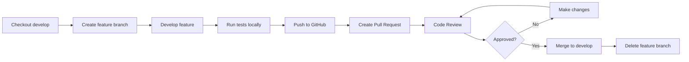

# Git Workflow Plan - Hybrid Stacking Thesis Project

## Overview

This document defines the Git branching strategy, commit conventions, and automated workflows for the Bachelor's Thesis project: **Hybrid Stacking (LSTM + LightGBM) for XAU/USD H1 Trading Signals**.

---

## 1. Branching Strategy

### Branch Structure

```
main (stable) ────────────────────────────────────────┐
                                                      ├──→ Production Releases
develop (integration) ────────────────────────────────┘
    │
    ├── feature/data-pipeline          (Data collection & preprocessing)
    ├── feature/model-training         (Model development & tuning)
    ├── feature/backtesting            (Backtesting engine)
    ├── feature/reporting              (Report generation)
    ├── bugfix/*                       (Bug fixes)
    └── hotfix/*                       (Critical production fixes)
```

### Branch Descriptions

| Branch | Purpose | Protection |
|--------|---------|------------|
| `main` | Stable, production-ready code. Only accepts merges from `develop`. Tagged releases. | 🔒 Protected |
| `develop` | Integration branch for features. Auto-deployed to staging. All features merge here first. | 🔒 Protected |
| `feature/*` | Individual feature development. Branched from `develop`, merged back to `develop`. | Temporary |
| `bugfix/*` | Non-urgent bug fixes for develop branch. | Temporary |
| `hotfix/*` | Critical fixes for `main` (bypasses develop). Merged to both `main` and `develop`. | Temporary |

### Naming Conventions

- **Feature branches**: `feature/<short-description>` (e.g., `feature/lstm-hyperparameter-tuning`)
- **Bug fixes**: `bugfix/<issue-number>-<description>` (e.g., `bugfix/042-fix-data-leakage`)
- **Hotfixes**: `hotfix/<critical-issue>-<description>` (e.g., `hotfix/critical-memory-leak`)

---

## 2. Commit Message Convention

We follow the **Conventional Commits** specification (https://www.conventionalcommits.org/).

### Format

```
<type>(<scope>): <subject>

<body>

<footer>
```

### Types

| Type | Description |
|------|-------------|
| `feat` | New feature |
| `fix` | Bug fix |
| `docs` | Documentation changes |
| `style` | Code style (formatting, semicolons, etc.) |
| `refactor` | Code refactoring (no functional change) |
| `perf` | Performance improvements |
| `test` | Adding or updating tests |
| `chore` | Maintenance tasks, dependencies |
| `ci` | CI/CD configuration changes |
| `build` | Build system or external dependency changes |

### Scopes (Project-Specific)

- `data` - Data pipeline, OHLCV conversion
- `features` - Feature engineering
- `labels` - Triple-barrier labeling
- `models` - LSTM, LightGBM, stacking models
- `backtest` - Backtesting engine
- `reporting` - Report generation
- `config` - Configuration management
- `pipeline` - Workflow orchestration
- `deps` - Dependencies (pixi, pip)
- `docs` - Documentation

### Examples

```bash
# Feature addition
feat(models): add hyperparameter optimization for LightGBM using Optuna

# Bug fix
fix(data): correct timezone handling in tick_to_ohlcv conversion

# Documentation
docs(readme): update installation instructions for Pixi workflow

# Refactoring
refactor(features): extract technical indicator calculation to separate module

# Performance
perf(pipeline): parallelize feature engineering with Polars

# Test addition
test(backtest): add unit tests for CFD simulation edge cases

# Dependency update
chore(deps): update PyTorch to 2.10.0 for CUDA 12 support
```

---

## 3. Merge Strategy

### Strategy: Merge Commits (Preserve History)

We use **merge commits** to preserve complete historical context:

```bash
# On develop branch
git checkout develop
git merge --no-ff feature/data-pipeline
```

**Why merge commits?**
- Preserves feature branch history
- Makes it easy to revert entire features
- Clear audit trail for thesis work
- Shows which commits belonged to which feature

### Merge Process

1. **Update local develop**: `git checkout develop && git pull origin develop`
2. **Merge feature**: `git merge --no-ff feature/my-feature`
3. **Resolve conflicts** (if any)
4. **Push**: `git push origin develop`

---

## 4. Pull Request Process

### PR Workflow



### PR Requirements

**Before creating a PR:**

- [ ] Code passes linting: `pixi run lint`
- [ ] Code is formatted: `pixi run format`
- [ ] Tests pass: `pixi run test`
- [ ] Commit messages follow convention
- [ ] Feature branch is rebased on latest `develop`

**PR Template:**

```markdown
## Description
Brief description of changes

## Type of Change
- [ ] ✨ New feature
- [ ] 🐛 Bug fix
- [ ] 📝 Documentation
- [ ] ♻️ Refactoring
- [ ] ⚡ Performance
- [ ] ✅ Tests

## Testing
Describe testing performed:
- Unit tests added/updated
- Manual testing steps
- Edge cases verified

## Checklist
- [ ] Code follows project style guidelines
- [ ] Self-review completed
- [ ] Comments added where necessary
- [ ] No new warnings
- [ ] Tests pass locally
```

### Review Process

1. **Author** creates PR, assigns reviewers
2. **Reviewers** review within 48 hours
3. **Automated checks** must pass (CI/CD)
4. **Approval** required from at least 1 reviewer
5. **Merge** by author or maintainer

---

## 5. Automated Workflows (GitHub Actions)

### Workflow Architecture

```
.push.yml           → Lint, Format, Test
merge-develop.yml   → Deploy to staging, run integration tests
release-main.yml    → Build, tag, deploy to production
```

### 5.1 Pre-Commit Checks (Local)

Install pre-commit hooks:

```bash
pixi add pre-commit
pre-commit install
```

### 5.2 CI Pipeline (`.github/workflows/ci.yml`)

Triggers: Push to any branch, PR creation

**Jobs:**

1. **Lint & Format**
   - Run Ruff linter
   - Check code formatting
   - Validate commit messages

2. **Test Suite**
   - Run pytest with coverage
   - Generate coverage report
   - Upload artifacts

3. **Security Scan**
   - Check for secrets/credentials
   - Dependency vulnerability scan
   - Code security analysis

### 5.3 Develop Branch Automation (`.github/workflows/develop.yml`)

Triggers: Push to `develop`

**Jobs:**

1. **Integration Tests**
   - Run full pipeline test
   - Validate model outputs
   - Check data integrity

2. **Staging Deployment**
   - Deploy to staging environment
   - Run smoke tests
   - Notify team

### 5.4 Main Branch Release (`.github/workflows/release.yml`)

Triggers: Push to `main`

**Jobs:**

1. **Final Validation**
   - Run all tests
   - Verify documentation builds
   - Check version tags

2. **Release Artifacts**
   - Create GitHub release
   - Build distribution packages
   - Publish documentation

3. **Deployment**
   - Deploy to production
   - Update changelog
   - Send release notifications

---

## 6. Environment Setup

### Initial Repository Setup

```bash
# Clone repository
git clone <repository-url>
cd thesis

# Install Pixi environment
curl -fsSL https://pixi.sh/install.sh | bash
pixi install

# Install pre-commit hooks
pixi run pre-commit install

# Set up git branches
git checkout -b develop
git push -u origin develop
```

### Daily Workflow

```bash
# Start work
git checkout develop
git pull origin develop
git checkout -b feature/my-new-feature

# During work
git add .
git commit -m "feat(scope): descriptive message"
git push -u origin feature/my-new-feature

# Before PR
git checkout develop
git pull origin develop
git checkout feature/my-new-feature
git rebase develop
pixi run lint
pixi run format
pixi run test

# After merge
git checkout develop
git pull origin develop
git branch -d feature/my-new-feature
git push origin --delete feature/my-new-feature
```

---

## 7. Version Control Best Practices

### Do's ✅

- Small, focused commits
- Descriptive commit messages
- Frequent pushes to remote
- Rebase before merging
- Delete merged branches
- Use `.gitignore` properly

### Don'ts ❌

- Never commit `.env`, credentials, or large data files
- Don't commit to `main` or `develop` directly
- Avoid force pushing shared branches
- Don't merge without review
- No "WIP" commits in final PR

### Git Ignore Rules

Already configured in `.gitignore`:

```
# Environment & Secrets
.env
.env.local
*.pem
*.key

# IDE
.vscode/
.idea/
*.swp

# Python
__pycache__/
*.pyc
.pytest_cache/
.ruff_cache/

# Project artifacts
logs/
models/*.pt
models/*.pkl
results/*.png
data/processed/*.parquet
data/raw/*.csv

# Jupyter
.ipynb_checkpoints/
*.ipynb (except main.ipynb)

# OS
.DS_Store
Thumbs.db
```

---

## 8. Release Management

### Version Numbering

Semantic Versioning: `MAJOR.MINOR.PATCH` (e.g., `v1.2.3`)

- **MAJOR**: Breaking changes
- **MINOR**: New features (backward compatible)
- **PATCH**: Bug fixes (backward compatible)

### Release Checklist

```markdown
## Pre-Release
- [ ] All tests passing
- [ ] Documentation updated
- [ ] Changelog reviewed
- [ ] Version bumped in src/thesis/__init__.py

## Release
- [ ] Create PR: develop → main
- [ ] Merge after approval
- [ ] Create Git tag: git tag -a v1.2.3 -m "Release v1.2.3"
- [ ] Push tag: git push origin v1.2.3
- [ ] GitHub release auto-created by CI

## Post-Release
- [ ] Deploy to production
- [ ] Update documentation site
- [ ] Notify stakeholders
- [ ] Monitor for issues
```

---

## 9. Monitoring & Metrics

### GitHub Insights

Track via GitHub Insights tab:
- Commit frequency
- Code frequency
- Contributor activity
- Dependency updates

### CI/CD Dashboards

Monitor GitHub Actions:
- Build success rate
- Test coverage trends
- Deployment frequency
- Mean time to recovery

---

## 10. Quick Reference

### Common Commands

```bash
# Create feature branch
git checkout develop
git pull
git checkout -b feature/my-feature

# Commit changes
git add .
git commit -m "feat(scope): description"

# Sync with develop
git fetch origin
git rebase origin/develop

# Run checks
pixi run lint
pixi run format
pixi run test

# Push feature
git push -u origin feature/my-feature

# After merge
git checkout develop
git pull
git branch -d feature/my-feature
```

### Branch Protection Rules (GitHub Settings)

Configure in Repository Settings → Branches:

**For `main`:**
- ✅ Require pull request reviews (1 approver)
- ✅ Require status checks to pass
- ✅ Require branches to be up to date
- ✅ Include administrators
- ✅ Restrict who can push

**For `develop`:**
- ✅ Require status checks to pass
- ✅ Require branches to be up to date
- ✅ Disallow force pushes

---

## Appendix A: File Structure Reference

```
thesis/
├── .github/
│   ├── workflows/        # CI/CD pipelines
│   ├── PULL_REQUEST_TEMPLATE.md
│   └── GIT_WORKFLOW.md   # This file
├── src/thesis/
│   ├── data/            # Data pipeline modules
│   ├── features/        # Feature engineering
│   ├── labels/          # Triple-barrier labeling
│   ├── models/          # ML models (LSTM, LightGBM)
│   ├── backtest/        # Backtesting engine
│   ├── reporting/       # Report generation
│   ├── config/          # Configuration loader
│   └── pipeline/        # Workflow orchestrator
├── tests/               # Test suite
├── data/
│   ├── raw/            # Raw tick data (not tracked)
│   ├── processed/      # Processed OHLCV (not tracked)
│   └── predictions/    # Model outputs (not tracked)
├── models/             # Trained models (.gitkeep only)
├── results/            # Results & visualizations (.gitkeep only)
├── logs/               # Log files (not tracked)
├── docs/               # Documentation
├── pixi.toml           # Environment & tasks
└── config.toml         # Pipeline configuration
```

---

## Appendix B: Useful Resources

- [Conventional Commits](https://www.conventionalcommits.org/)
- [Git Flow](https://nvie.com/posts/a-successful-git-branching-model/)
- [GitHub Actions Documentation](https://docs.github.com/en/actions)
- [Ruff Documentation](https://docs.astral.sh/ruff/)
- [Pixi Documentation](https://pixi.sh/)

---

**Document Version**: 1.0  
**Last Updated**: 2026-03-29  
**Maintained By**: Nguyen Duc Hieu
