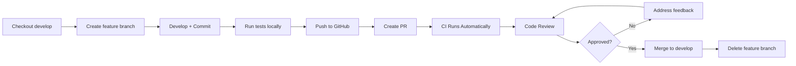

# Git Branching & Workflow Implementation Plan

## Overview

This document tracks the implementation of the Git workflow for the Hybrid Stacking Thesis project.

**Status**: ✅ **COMPLETE**  
**Date Created**: 2026-03-29  
**Last Updated**: 2026-03-29

---

## 1. Branch Structure Setup

### Current State

```bash
$ git branch -a
  develop
* main (no commits yet)
```

### Required Actions

- [x] Document branching strategy in `.github/GIT_WORKFLOW.md`
- [ ] Create initial commit on `main` branch
- [ ] Ensure `develop` branch is protected
- [ ] Configure branch protection rules (see Section 5)

### Target Structure

```
main (stable, protected) ─────────────────────┐
                                              ├──→ Production Releases
develop (integration, protected) ─────────────┘
    │
    ├── feature/data-pipeline
    ├── feature/model-training
    ├── feature/backtesting
    ├── feature/reporting
    ├── bugfix/*
    └── hotfix/*
```

---

## 2. GitHub Actions Workflows

### Files Created

| File | Purpose | Status |
|------|---------|--------|
| `.github/workflows/ci.yml` | Pre-merge CI checks | ✅ Created |
| `.github/workflows/develop.yml` | Develop branch integration | ✅ Created |
| `.github/workflows/release.yml` | Main branch releases | ✅ Created |

### Workflow Triggers

#### CI Pipeline (`ci.yml`)
- **Triggers**: Push to feature branches, PR creation
- **Jobs**:
  - Lint & Format Check
  - Test Suite
  - Security Scan
  - Code Quality Analysis
  - Pipeline Validation

#### Develop Integration (`develop.yml`)
- **Triggers**: Push to `develop`
- **Jobs**:
  - Integration Tests
  - Staging Deployment Check
  - Notify Develop Push

#### Release Pipeline (`release.yml`)
- **Triggers**: Push to `main`
- **Jobs**:
  - Final Validation
  - Create GitHub Release (with tag)
  - Deploy Release Artifacts
  - Notify Release

### Next Steps

- [ ] Review workflow files for accuracy
- [ ] Customize notification integrations (Slack, Discord, email)
- [ ] Add Codecov integration for coverage reporting
- [ ] Configure deployment targets if needed

---

## 3. Commit Convention

### Documentation

- [x] Created `.github/COMMIT_CONVENTION.md` with examples
- [x] Defined types and scopes specific to thesis project
- [x] Included anti-patterns and best practices

### Implementation

- [ ] Install pre-commit hooks:
  ```bash
  pixi add pre-commit
  pre-commit install
  ```

- [ ] Optional: Add commitlint configuration
  ```toml
  # Add to pyproject.toml or create .commitlintrc
  ```

### Common Scopes for This Project

- `data`: Data pipeline modules
- `features`: Feature engineering
- `labels`: Triple-barrier labeling
- `models`: LSTM, LightGBM, stacking
- `backtest`: Backtesting engine
- `reporting`: Report generation
- `config`: Configuration loader
- `pipeline`: Workflow orchestration

---

## 4. Pull Request Process

### Templates

- [x] Created `.github/PULL_REQUEST_TEMPLATE.md`
- [x] Includes checklist for authors and reviewers
- [x] Configured type selection and testing requirements

### Workflow



### Required Checks Before Merge

- [ ] Linting passes (`pixi run lint`)
- [ ] Formatting correct (`pixi run format`)
- [ ] Tests pass (`pixi run test`)
- [ ] Security scan clear
- [ ] At least 1 reviewer approval
- [ ] No merge conflicts

---

## 5. Branch Protection Rules

### Configuration (Manual Setup Required)

Navigate to: **GitHub Repo → Settings → Branches → Add branch protection rule**

#### For `main` branch:

```
Branch name pattern: main

✅ Require a pull request before merging
   - Require approvals: 1
   - Dismiss stale pull request approvals when new commits are pushed

✅ Require status checks to pass before merging
   - Required status checks:
     - Lint & Format Check
     - Test Suite
     - Security Scan
     - Final Validation

✅ Require branches to be up to date before merging

✅ Include administrators

✅ Restrict who can push to matching branches
   - Only allow: Maintainers (configure as needed)

✅ Allow force pushes: NO
✅ Allow deletions: NO
```

#### For `develop` branch:

```
Branch name pattern: develop

✅ Require status checks to pass before merging
   - Required status checks:
     - Lint & Format Check
     - Test Suite
     - Integration Tests

✅ Require branches to be up to date before merging

✅ Disallow force pushes

✅ Block force pushes
```

---

## 6. Merge Strategy

### Strategy: Merge Commits (--no-ff)

We preserve complete history using merge commits.

### Commands

```bash
# Merge feature to develop
git checkout develop
git pull origin develop
git merge --no-ff feature/my-feature
git push origin develop

# Merge develop to main (via PR)
# GitHub will automatically create merge commit
```

### Why Merge Commits?

✅ Preserves feature branch history  
✅ Easy to revert entire features  
✅ Clear audit trail for thesis work  
✅ Shows which commits belonged to which feature  

❌ Slightly more complex history graph (acceptable tradeoff)

---

## 7. Daily Developer Workflow

### Starting Work

```bash
# Get latest develop
git checkout develop
git pull origin develop

# Create feature branch
git checkout -b feature/my-new-feature
```

### During Development

```bash
# Make changes
git add .
git commit -m "feat(scope): descriptive message"

# Keep feature branch updated
git fetch origin
git rebase origin/develop
```

### Before Creating PR

```bash
# Ensure clean state
git checkout develop
git pull origin develop
git checkout feature/my-feature
git rebase develop

# Run all checks
pixi run lint
pixi run format
pixi run test

# Push feature branch
git push -u origin feature/my-feature
```

### After PR Merge

```bash
# Clean up local branches
git checkout develop
git pull origin develop
git branch -d feature/my-feature

# Clean up remote branch
git push origin --delete feature/my-feature
```

---

## 8. Environment Verification

### Initial Setup Checklist

```bash
# 1. Clone repository (if starting fresh)
git clone <repository-url>
cd thesis

# 2. Install Pixi environment
curl -fsSL https://pixi.sh/install.sh | bash
pixi install

# 3. Verify project structure
ls -la
# Should see: src/, data/, models/, results/, docs/, .github/

# 4. Install pre-commit hooks (recommended)
pixi add pre-commit
pre-commit install

# 5. Test basic commands
pixi run lint
pixi run format
pixi run test
```

### Git Configuration

```bash
# Set user info (if not already set)
git config --global user.name "Your Name"
git config --global user.email "your.email@example.com"

# Verify
git config --list | grep user
```

---

## 9. Monitoring & Metrics

### GitHub Insights

Track via: **Insights** tab in GitHub repository

- **Pulse**: Recent activity
- **Graphs**: Commit frequency, code frequency, contributor stats
- **Community**: Traffic, clones, views
- **Dependencies**: Dependency graph and security alerts

### CI/CD Metrics

Monitor in **Actions** tab:

- Build success rate
- Average build time
- Test coverage trends
- Deployment frequency

### Recommended Dashboards

1. **Code Quality Dashboard**
   - Linting errors trend
   - Test coverage percentage
   - Dead code detection results

2. **Velocity Dashboard**
   - Commits per week
   - PRs merged per week
   - Average PR review time

3. **Release Dashboard**
   - Release frequency
   - Time between releases
   - Bug fix rate

---

## 10. Troubleshooting

### Common Issues

#### Issue: "Permission denied" when pushing

```bash
# Solution: Verify authentication
gh auth status

# Or use HTTPS with token
git remote set-url origin https://github.com/USERNAME/thesis.git
```

#### Issue: Merge conflicts after rebase

```bash
# Abort rebase if needed
git rebase --abort

# Or resolve conflicts manually
git mergetool
git rebase --continue
```

#### Issue: CI checks failing

```bash
# Run checks locally to debug
pixi run lint      # Check for linting errors
pixi run format    # Check formatting
pixi run test      # Run tests

# View CI logs in GitHub Actions tab
```

#### Issue: Accidentally committed to wrong branch

```bash
# If you committed to develop but meant feature branch
git checkout -b feature/my-feature HEAD~1
git checkout develop
git reset --hard HEAD~1
# Now on correct branch with your commit
```

---

## 11. Future Enhancements

### Phase 2 (Recommended)

- [ ] Add automated changelog generation
- [ ] Integrate with project management tool (GitHub Projects, Jira)
- [ ] Set up automated dependency updates (Dependabot)
- [ ] Add performance regression testing
- [ ] Configure automated documentation deployment

### Phase 3 (Advanced)

- [ ] Implement GitOps for infrastructure
- [ ] Add automated model validation gates
- [ ] Set up A/B testing framework for models
- [ ] Integrate experiment tracking (MLflow, Weights & Biases)

---

## 12. Success Criteria

### ✅ Workflow is working when:

- [ ] All CI checks pass on PR creation
- [ ] Feature branches merge cleanly to develop
- [ ] Develop deploys to staging successfully
- [ ] Main branch creates tagged releases
- [ ] Team follows commit conventions consistently
- [ ] PR review process is smooth
- [ ] No direct commits to protected branches

### 📊 Metrics to Track

- Average time from PR creation to merge
- Number of CI failures per week
- Percentage of commits following convention
- Test coverage trend
- Release frequency

---

## Appendix: Quick Reference Card

### Branch Naming

```
feature/description
bugfix/issue-number-description
hotfix/critical-issue-description
```

### Commit Types

```
feat: New feature
fix: Bug fix
docs: Documentation
refactor: Code restructuring
perf: Performance
test: Tests
chore: Maintenance
ci: CI/CD
```

### Essential Commands

```bash
# Start feature
git checkout develop && git pull
git checkout -b feature/my-feature

# Commit
git add . && git commit -m "type(scope): message"

# Sync with develop
git fetch && git rebase origin/develop

# Run checks
pixi run lint && pixi run format && pixi run test

# After merge
git checkout develop && git pull
git branch -d feature/my-feature
```

---

**Document Owner**: Nguyen Duc Hieu  
**Review Cycle**: Update as workflow evolves  
**Related Documents**:
- `.github/GIT_WORKFLOW.md` - Full workflow documentation
- `.github/COMMIT_CONVENTION.md` - Commit message guide
- `.github/PULL_REQUEST_TEMPLATE.md` - PR template
