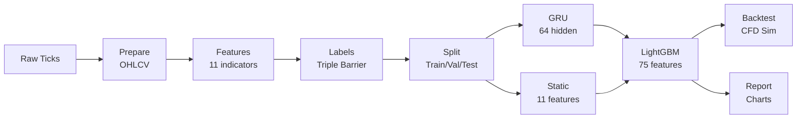
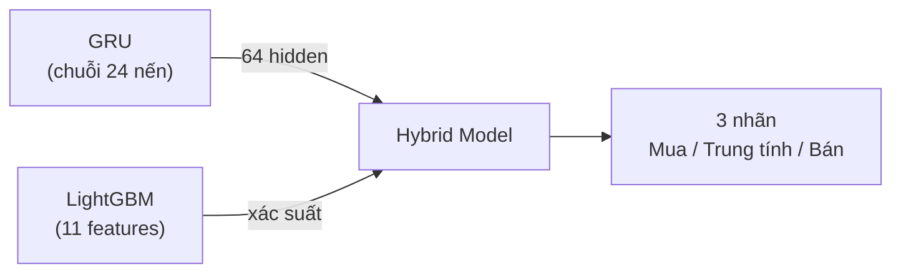

# Hybrid GRU + LightGBM

### XAU/USD Trading Signal Prediction

[](https://www.python.org/)
[](https://pixi.sh/)
[](https://lightgbm.readthedocs.io/)
[](https://pytorch.org/)

**Machine-learning pipeline for gold (XAU/USD) trading signal prediction**
using a hybrid GRU + LightGBM architecture.

Bachelor's thesis — Thuy Loi University

---

## Documentation

| Document | Description |
|:---------|:------------|
| 📐 [Architecture](docs/ARCHITECTURE.md) | High-level overview — pipeline stages, hybrid model design, data flow |
| 🚀 [Quickstart](docs/QUICKSTART.md) | Step-by-step guide to install, run, and view results |
| 📊 [Evaluation](docs/EVALUATION.md) | How to read your results — metrics explained in plain language |
| 📋 [Roadmap](docs/ROADMAP.md) | Completed features vs. pending items |
| ⚙️ [Features & Configuration](docs/CONFIGURATION.md) | What the model sees and how to tune every parameter |
| 📖 [Glossary](docs/GLOSSARY.md) | Plain-English definitions for all technical terms |

### Where to start?

| You are... | Read this |
|------------|-----------|
| New to the project | [Architecture](docs/ARCHITECTURE.md) → [Quickstart](docs/QUICKSTART.md) → [Evaluation](docs/EVALUATION.md) |
| Looking to improve results | [Configuration](docs/CONFIGURATION.md) — read the **Features** section first |
| Confused by a term | [Glossary](docs/GLOSSARY.md) |

---

## Quick Start

```bash
pixi install          # Install dependencies
pixi run data         # Download XAU/USD data
pixi run workflow     # Run the full pipeline
```

Results are saved to `results/XAUUSD_1H_<timestamp>/`.

---

## How It Works



The hybrid model works in two steps:

1. **GRU** reads 24 hours of price history and outputs a **64-number summary** of temporal patterns.
2. **LightGBM** combines those 64 numbers with **11 technical indicators** (75 features total) and predicts: **Long**, **Flat**, or **Short**.

---

## Commands

| Command | Description |
|---------|-------------|
| `pixi run workflow` | Run full pipeline (cached) |
| `pixi run force` | Force re-run all stages |
| `pixi run ablation` | Pipeline + model comparison study |
| `pixi run test` | Run tests with coverage |
| `pixi run lint` | Check code style |
| `pixi run format` | Auto-format code |

---

## Project at a Glance

| Detail | Value |
|--------|-------|
| Asset | XAU/USD (Gold / US Dollar) |
| Timeframe | 1 hour (H1) |
| Data range | January 2018 – March 2026 |
| Model | GRU (64-dim) → LightGBM (75 features) |
| Features | 11 technical indicators + 64 GRU hidden states |
| Labels | Triple Barrier (Long / Flat / Short) |
| Backtest | CFD with spread, commission, leverage, risk management |
| Python | 3.13 (Pixi) |

---

## Project Structure

```
thesis/
├── config.toml              # All settings in one file
├── main.py                  # Entry point (CLI)
├── src/thesis/              # Source code
│   ├── config.py            # Loads config.toml
│   ├── prepare.py           # Tick data → OHLCV bars
│   ├── features.py          # 11 technical indicators
│   ├── labels.py            # Triple Barrier labels
│   ├── data.py              # Train/val/test splitting
│   ├── gru_model.py         # GRU neural network
│   ├── model.py             # Hybrid training (GRU + LightGBM)
│   ├── pipeline.py          # Orchestrates all stages
│   ├── backtest.py          # CFD trading simulator
│   ├── ablation.py          # Compare model variants
│   ├── report.py            # Markdown report generator
│   └── visualize.py         # 13 charts
├── tests/                   # Test suite
├── data/raw/XAUUSD/         # Raw tick data
├── data/processed/          # Generated parquet files
├── results/                 # Session-based outputs
└── docs/                    # Documentation
```

---

## Tài liệu luận văn (Tiếng Việt)

<details>
<summary>📄 Nhấn để mở tài liệu luận văn tiếng Việt</summary>

# Ứng dụng mô hình Hybrid Stacking dự báo tín hiệu giao dịch CFD Vàng (XAU/USD)

> Đồ án tốt nghiệp — Trường Đại học Thuỷ Lợi, Khoa Công nghệ Thông tin

| Thông tin | Chi tiết |
|-----------|----------|
| **Sinh viên** | Nguyễn Đức Hiếu — 63CNTT.VA — 2151061192 |
| **Giáo viên hướng dẫn** | Hoàng Quốc Dũng |
| **Khung thời gian** | H1 (1 giờ) |
| **Dải dữ liệu** | 01/2018 – 03/2026 |

---

## Tổng quan

Xây dựng pipeline end-to-end dự báo tín hiệu giao dịch **CFD Vàng (XAU/USD)** trên khung H1 bằng kiến trúc **Hybrid Stacking (GRU + LightGBM)**.



## Mục tiêu chính

1. Thu thập và chuẩn hóa dữ liệu CFD Vàng H1 (01/2018 – 03/2026)
2. Làm sạch dữ liệu: lọc nến bất thường, bỏ cuối tuần, xử lý gap phiên
3. Chia tập theo thời gian (không xáo trộn): Train (2018–2022) / Val (2023) / OOS (2024–03/2026)
4. Ngăn rò rỉ dữ liệu bằng Purging + Embargo
5. Xây dựng đặc trưng kỹ thuật + định lượng bằng Feature Importance / SHAP
6. Huấn luyện mô hình GRU nền + LightGBM nền
7. Xây dựng Hybrid Stacking
8. Giải thích mô hình (SHAP) + Backtest trên OOS

## Đặc trưng kỹ thuật

| Nhóm | Đặc trưng | Câu hỏi thị trường |
|------|-----------|---------------------|
| Xu hướng | EMA, price_dist_ratio | Giá đang tăng hay giảm? |
| Động lượng | RSI(14) | Đà tăng/giảm mạnh hay yếu? |
| Biến động | ATR(14), atr_ratio, atr_percentile | Thị trường rộng hay hẹp biên? |
| Sức mạnh xu hướng | MACD(12, 26, 9) | Xu hướng còn mạnh không? |
| Phiên giao dịch | Session (DST-aware) | Giá khác nhau theo phiên? |
| Hỗ trợ/Kháng cự | Pivot Position | Gần vùng quan trọng không? |

## Chiến lược gán nhãn (Triple Barrier)

| Nhãn | Điều kiện | Ý nghĩa |
|------|-----------|---------|
| **+1** | Giá chạm TP trước SL | **Mua** |
| **0** | Không chạm TP/SL đến hết horizon | **Trung tính** |
| **-1** | Giá chạm SL trước TP | **Bán** |

- **Take Profit:** `Close[t] + 1.5 × ATR`
- **Stop Loss:** `Close[t] - 1.5 × ATR`
- **Horizon:** h = 10 nến

## Tiến độ thực hiện

| Tuần | Nội dung | Kết quả |
|------|----------|---------|
| 1 | Xác định yêu cầu, tìm tài liệu | Đề cương kỹ thuật |
| 2 | Tải & chuẩn hóa dữ liệu | Dữ liệu sạch |
| 3 | Tính chỉ báo, gán nhãn, chia tập | Dữ liệu sẵn sàng |
| 4 | Huấn luyện LightGBM | Mô hình + kết quả ban đầu |
| 5 | Huấn luyện GRU + Hybrid | Hybrid hoàn chỉnh |
| 6 | So sánh mô hình, backtest, SHAP | Số liệu đầy đủ |
| 7–10 | Viết báo cáo + thuyết trình | Báo cáo cuối + slide |

## Yêu cầu hệ thống

| Yêu cầu | Chi tiết |
|---------|----------|
| Python | 3.13+ |
| RAM | 8GB+ |
| GPU | Tùy chọn |
| Dung lượng | 10GB+ |

## Hướng phát triển

1. Ensemble nâng cao, weighted voting
2. Sentiment analysis, chỉ số vĩ mô
3. Dynamic position sizing, VaR-based limits
4. Real-time WebSocket prediction
5. Đa tài sản: EUR/USD, GBP/USD, XAG/USD

*Cập nhật lần cuối: Tháng 4/2026*

</details>
