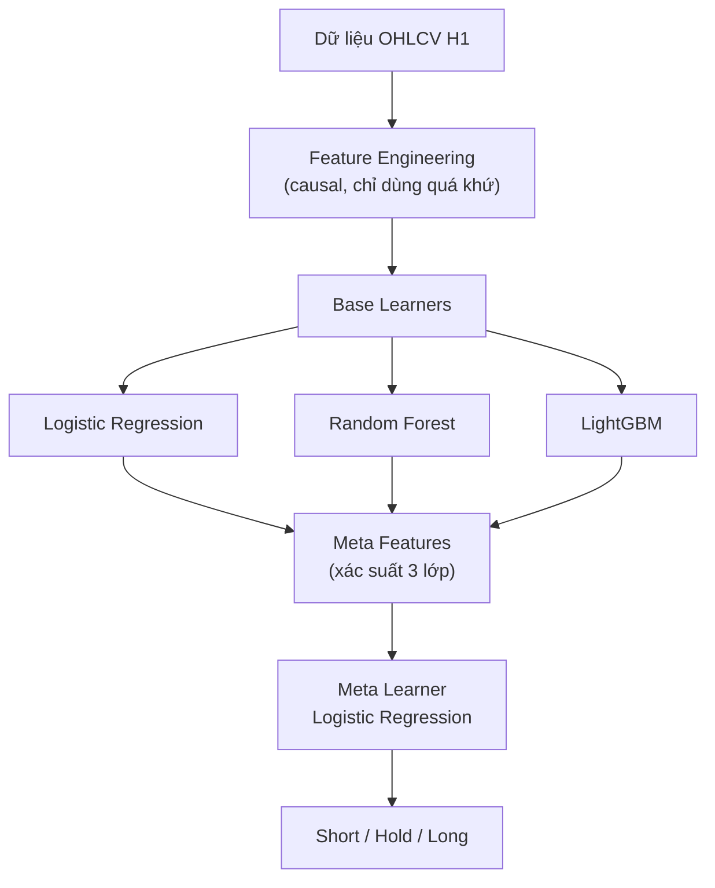

# CHƯƠNG 1. TỔNG QUAN

## 1.1. Tổng quan học máy trong tài chính

Như phần Mở đầu đã trình bày, thị trường tài chính là môi trường dữ liệu phức tạp, nơi giá tài sản chịu tác động đồng thời của nhiều yếu tố vĩ mô, tâm lý và thanh khoản [1], [2]. Chương này mở rộng bối cảnh nghiên cứu bằng cách tổng quan các hướng tiếp cận học máy trong dự báo tài chính và giải thích lựa chọn phương pháp của đề tài.

### Các hướng tiếp cận chính

**Phương pháp thống kê truyền thống.** Các mô hình như ARIMA, GARCH và VAR từng là công cụ phổ biến để mô hình hóa chuỗi thời gian tài chính [4]. ARIMA nắm bắt tự tương quan tuyến tính, GARCH mô hình hóa cụm biến động. Tuy nhiên, các mô hình này giả định dạng hàm cố định và ít khả năng nắm bắt quan hệ phi tuyến phức tạp trong dữ liệu thị trường [2].

**Học máy cổ điển (Classic ML).** Logistic Regression, Random Forest và Gradient Boosting là các mô hình hiệu quả trên dữ liệu tabular [14], [15], [16]. Patel et al. [12] cho thấy kết hợp nhiều kỹ thuật học máy có cải thiện dự báo chỉ số chứng khoán so với mô hình đơn lẻ. Krauss et al. [13] chứng minh Random Forest và Gradient Boosted Trees đạt kết quả khả quan cho statistical arbitrage trên S&P 500. Các mô hình này có lợi thế: khả năng diễn giải cao, huấn luyện nhanh và phù hợp khi số lượng mẫu ở mức trung bình (vài chục nghìn mẫu H1).

**Học sâu (Deep Learning).** LSTM, Transformer và các kiến trúc mạng sâu đã được áp dụng rộng rãi trong dự báo chuỗi thời gian tài chính [24]. Tuy nhiên, deep learning thường cần lượng dữ liệu rất lớn, dễ overfit trên dữ liệu tài chính nhiễu cao, và khó diễn giải — điều quan trọng trong bối cảnh nghiên cứu phương pháp luận [5]. Đối với đề tài này, với mục tiêu minh bạch hóa pipeline và so sánh baseline, classic ML phù hợp hơn.

**Lựa chọn của đề tài.** Đề tài chọn classic tabular ML kết hợp stacked generalization [18] vì ba lý do: (i) dữ liệu OHLCV H1 là dữ liệu tabular với số lượng đặc trưng hữu hạn; (ii) mô hình cổ điển cho phép phân tích đóng góp từng base learner và diễn giải kết quả bằng SHAP [22]; (iii) stacking cung cấp cơ chế kết hợp có kiểm soát thay vì phụ thuộc một mô hình duy nhất.

## 1.2. Bài toán phân loại tín hiệu giao dịch

Bài toán được mô hình hóa thành phân loại ba lớp:

```text
Short (-1): ưu tiên tín hiệu bán
Hold  (0): không đủ điều kiện giao dịch
Long  (+1): ưu tiên tín hiệu mua
```

**Vì sao chọn phân loại thay vì hồi quy.** Dự báo giá tuyệt đối (regression) thường đánh giá bằng sai số tuyệt đối hoặc bình phương, nhưng không phản ánh trực tiếp khả năng ra quyết định giao dịch. Phân loại tín hiệu chuyển bài toán về dạng "nên làm gì" thay vì "giá sẽ là bao nhiêu", phù hợp hơn với mục tiêu thực tiễn [5].

**Vì sao cần ba lớp thay vì nhị phân.** Gán nhãn tăng/giảm đơn giản ("giá sau N nến cao hơn thì Long, thấp hơn thì Short") thường quá thô vì không xét stop-loss, take-profit, thời gian giữ lệnh và biến động thị trường. Lớp Hold cho phép mô hình thừa nhận khoảng thời gian không có tín hiệu rõ ràng, giảm số lượng giao dịch sai do nhiễu. Để khắc phục hạn chế của nhãn tăng/giảm đơn giản, đề tài sử dụng triple-barrier labeling theo hướng của López de Prado [5], trong đó mỗi mẫu có take-profit, stop-loss và horizon (xem chi tiết tại Chương 2).

## 1.3. Câu hỏi nghiên cứu

Để tránh việc đề tài bị hiểu như một hệ thống giao dịch hoàn chỉnh, các câu hỏi nghiên cứu được đặt theo hướng kiểm định pipeline học máy:

1. Có thể xây dựng một pipeline từ dữ liệu XAU/USD H1 đến dự báo Short/Hold/Long mà không dùng thông tin tương lai hay không?
2. Triple-barrier labeling dựa trên ATR có tạo được nhãn có ý nghĩa giao dịch hơn nhãn tăng/giảm đơn giản hay không?
3. Walk-forward validation có purge/embargo có giúp đánh giá thực tế hơn random split trong bối cảnh nhãn có event horizon hay không?
4. Classic Hybrid Stacking có cải thiện so với Logistic Regression, Random Forest và LightGBM đơn lẻ hay không?
5. Khi mô hình phức tạp không vượt baseline mạnh, có thể rút ra kết luận học thuật gì về dữ liệu tài chính nhiễu cao?
6. Backtest demo cho thấy tín hiệu có thể chuyển thành hành động giao dịch như thế nào và còn thiếu gì để tiến tới triển khai thực tế?

Những câu hỏi này giúp luận văn có cấu trúc kiểm định rõ ràng. Nếu chỉ hỏi "mô hình có kiếm tiền không", báo cáo sẽ phụ thuộc quá nhiều vào một kết quả backtest cụ thể, trong khi backtest có thể bị ảnh hưởng mạnh bởi chi phí giao dịch, thời điểm chọn mẫu, tham số threshold và các giả định thực thi [7], [9].

## 1.4. Kiến trúc đề xuất

Kiến trúc runtime chính là Classic Hybrid Stacking, hoạt động theo nguyên lý stacked generalization [18]. Hình 1.1 mô tả kiến trúc tổng thể.



**Hình 1.1.** Kiến trúc Classic Hybrid Stacking.

### Lựa chọn base learners

Kiến trúc kết hợp ba họ mô hình có bản chất khác nhau để tăng tính đa dạng (diversity) của ensemble:

- **Logistic Regression** [14] đại diện cho mô hình tuyến tính, dễ giải thích, đóng vai trò baseline tuyến tính trong stacking. Mô hình giả định ranh giới quyết định tuyến tính, phù hợp để nắm bắt các quan hệ đơn giản mà mô hình phi tuyến có thể bỏ qua hoặc overfit.

- **Random Forest** [15] đại diện cho bagging tree, giảm phương sai bằng cách trung bình hóa nhiều cây quyết định huấn luyện trên các tập con ngẫu nhiên. Breiman chỉ ra rằng Random Forest có khả năng kiểm soát overfit tốt hơn cây quyết định đơn lẻ nhờ cơ chế bootstrap aggregation.

- **LightGBM** [17] đại diện cho gradient boosting tree, huấn luyện cây tuần tự để sửa lỗi của cây trước đó [16]. LightGBM sử dụng histogram-based splitting và leaf-wise growth, hiệu quả trên dữ liệu tabular với tốc độ huấn luyện nhanh. Ke et al. [17] chứng minh LightGBM đạt hiệu năng tương đương hoặc vượt các triển khai boosting khác với thời gian huấn luyện thấp hơn đáng kể.

### Meta learner

Meta-model Logistic Regression học cách kết hợp xác suất dự báo (probability) của ba base learners theo nguyên lý stacked generalization [18]. Đầu vào là vector xác suất 9 chiều (3 mô hình × 3 lớp), đầu ra là phân loại cuối cùng. Ju et al. [19] cho thấy stacking kết hợp mô hình cây và linear model có thể cải thiện dự báo chỉ số chứng khoán so với mô hình đơn lẻ.

Lưu ý: "Hybrid" trong đề tài không có nghĩa là kết hợp mạng sâu với mô hình cây, mà là kết hợp nhiều họ mô hình cổ điển có bản chất khác nhau trong cùng một pipeline.

## 1.5. Đóng góp chính

Đóng góp chính của đồ án tập trung vào thiết kế pipeline và phương pháp đánh giá:

- **Pipeline causal**: Mọi đặc trưng kỹ thuật chỉ sử dụng thông tin quá khứ và hiện tại, không dùng thông tin tương lai. Điều này khác với nhiều nghiên cứu sử dụng random split mà không kiểm soát rò rỉ dữ liệu [5], [7].
- **Walk-forward validation có purge/embargo**: Mô phỏng huấn luyện trên quá khứ và kiểm tra trên tương lai, đồng thời giảm rò rỉ thông tin do nhãn có horizon [5].
- **Triple-barrier labeling**: Nhãn phản ánh logic take-profit/stop-loss/horizon thay vì chỉ so sánh giá đơn thuần.
- **So sánh đa baseline**: Naive, Majority, Random baseline và từng base learner đơn lẻ, đảm bảo kết quả có giá trị tham chiếu thay vì chỉ báo cáo một mô hình duy nhất.
- **Báo cáo trung thực**: Trình bày kết quả ngay cả khi mô hình phức tạp không vượt baseline mạnh, vì kết quả âm tính vẫn có giá trị học thuật khi được phân tích đúng [9].

## 1.6. Phạm vi và giới hạn

Như phần Mở đầu (mục 4 và 8) đã trình bày chi tiết, đề tài tập trung vào pipeline dự báo tín hiệu XAU/USD H1 dựa trên dữ liệu OHLCV, sử dụng đặc trưng kỹ thuật và mô hình học máy cổ điển. Đề tài không bao gồm tối ưu hệ thống giao dịch thực chiến, dự báo tin tức, quản trị vốn nâng cao hay cam kết lợi nhuận. Độc giả vui lòng tham khảo Mở đầu để biết đầy đủ phạm vi và giới hạn nghiên cứu.
