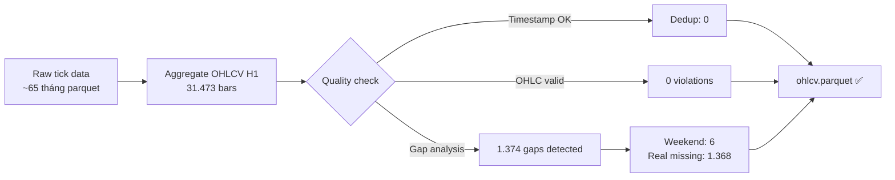
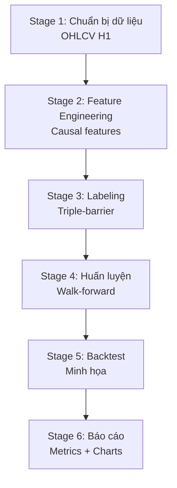

# CHƯƠNG 3. DỮ LIỆU VÀ PHƯƠNG PHÁP

## 3.1. Nguồn dữ liệu

Dữ liệu sử dụng trong đồ án là dữ liệu XAU/USD được xử lý thành thanh OHLCV khung 1 giờ. XAU/USD biểu diễn giá vàng theo đô la Mỹ. Vàng là thị trường có thanh khoản cao và chịu tác động của nhiều yếu tố như lãi suất thực, lạm phát kỳ vọng, rủi ro địa chính trị, nhu cầu đầu tư và hoạt động mua bán của ngân hàng trung ương [3].

Bảng dưới đây mô tả bộ dữ liệu:

| Thuộc tính | Giá trị |
|---|---|
| Tài sản | XAU/USD |
| Khung thời gian | H1 |
| Giai đoạn dữ liệu | 2021-01-03 đến 2026-04-30 |
| Dạng xử lý | OHLCV |
| Múi giờ | America/New_York |
| Bài toán | Phân loại Short/Hold/Long |

Dữ liệu tài chính theo chuỗi thời gian không được xáo trộn ngẫu nhiên khi đánh giá. Mọi bước xử lý cần giữ thứ tự thời gian và tránh sử dụng thông tin tương lai.

## 3.2. Từ tick đến OHLCV

Nếu dữ liệu gốc ở dạng tick, pipeline tổng hợp thành OHLCV theo từng giờ:

- Open: giá đầu tiên trong giờ.
- High: giá cao nhất trong giờ.
- Low: giá thấp nhất trong giờ.
- Close: giá cuối cùng trong giờ.
- Volume: tổng khối lượng hoặc proxy volume trong giờ.

Trường hợp có bid/ask, giá mid có thể được tính bằng:

```text
mid_price = (bid + ask) / 2
```

Việc dùng OHLCV H1 giúp cân bằng giữa chi tiết intraday và nhiễu microstructure. Khung nhỏ hơn như M1/M5 thường nhiễu hơn và nhạy với spread/slippage; khung lớn hơn như D1 có ít mẫu hơn.

## 3.3. Kiểm tra chất lượng dữ liệu

Pipeline kiểm tra các điều kiện sau:

1. Timestamp tăng dần.
2. Không có timestamp trùng lặp.
3. Các cột OHLCV bắt buộc tồn tại.
4. Không có giá âm hoặc bất hợp lý.
5. Ghi nhận gap thời gian do cuối tuần, ngày nghỉ hoặc thiếu dữ liệu.
6. Kiểm tra thống kê cơ bản của close, return, volume và ATR.

Các gap cuối tuần không được nội suy thành thanh giả vì thị trường thực tế không giao dịch. Việc nội suy có thể tạo ra dữ liệu nhân tạo và làm sai feature kỹ thuật.

### Kết quả kiểm tra chất lượng dữ liệu

Bảng dưới đây trình bày kết quả kiểm tra chất lượng của bộ dữ liệu XAU/USD H1 sau khi chạy Stage 1:

| Chỉ tiêu | Giá trị |
|---|---|
| Tổng số thanh (bars) | 31.473 |
| Timestamp trùng bị loại | 0 |
| Ngày bắt đầu | 2021-01-03 23:00 |
| Ngày kết thúc | 2026-04-30 23:00 |
| Tổng số gap lịch | 1.374 |
| — Gap cuối tuần/ngày nghỉ | 6 |
| — Gap thực tế (thiếu dữ liệu) | 1.368 |
| Số thanh thiếu ước tính | 1.537 |
| Gap lớn nhất | 74 thanh |
| Tỷ lệ thiếu | 3,49% |

Kiểm tra tính nhất quán OHLCV cho thấy không có vi phạm (0 vi phạm ràng buộc High ≥ Low, High ≥ Close, v.v.) và không có giá âm.

Phân tích outlier cho thấy 141 thanh có |return| vượt ngưỡng 3σ (chiếm 0,45%), với return lớn nhất là +2,55% và nhỏ nhất là −5,89%. Các outlier này không bị loại bỏ vì trong thị trường vàng, spike giá có thể phản ánh sự kiện kinh tế vĩ mô thực tế [2].



Hình 3.1 minh họa quy trình kiểm tra chất lượng dữ liệu từ tick đến OHLCV H1.

## 3.4. Phân tích khám phá dữ liệu (EDA)

Phân tích khám phá dữ liệu (Exploratory Data Analysis) được thực hiện trên bộ dữ liệu OHLCV H1 sau khi đã qua kiểm tra chất lượng, nhằm hiểu rõ đặc điểm thống kê trước khi xây dựng feature và mô hình.

### 3.4.1. Thống kê mô tả

Bảng dưới đây trình bày thống kê cơ bản của các biến chính trong bộ dữ liệu:

| Biến | Trung bình | Độ lệch chuẩn | Min | Trung vị | Max |
|---|---:|---:|---:|---:|---:|
| Close (USD) | 2.432,66 | 895,58 | 1.616,70 | 1.976,51 | 5.562,58 |
| Log-return | 0,000028 | 0,002263 | −0,0589 | 0,000035 | 0,0255 |
| ATR14 (% close) | 0,288% | 0,168% | 0,079% | — | 3,175% |
| Volume | 4,15 | 3,14 | 0,05 | 3,32 | 36,07 |

Giá vàng dao động từ khoảng 1.617 USD đến hơn 5.562 USD trong giai đoạn 2021–2026, phản ánh xu hướng tăng mạnh và biến động cao đặc biệt từ năm 2024 trở đi. Độ lệch chuẩn của close (895 USD) cho thấy phạm vi giá rất rộng, trong khi log-return có độ lệch chuẩn 0,23% — mức biến động giờ điển hình của thị trường vàng.

Hình 3.2 trình bày biểu đồ chuỗi giá close và phân phối log-return của XAU/USD H1.

### 3.4.2. Phân phối lợi suất

Phân phối log-return giờ của XAU/USD H1 có các đặc điểm sau:

| Chỉ số | Giá trị | Diễn giải |
|---|---:|---|
| Skewness | −1,345 | Lệch trái — sụt giảm mạnh xảy ra thường hơn và khắc nghiệt hơn tăng giá |
| Excess kurtosis | 36,99 | Đuôi rất dày — nhiều outlier hơn phân phối chuẩn rất nhiều |
| Jarque-Bera | 1.803.404 | Bác bỏ giả thuyết phân phối chuẩn (p ≈ 0) |

Phân phối lợi suất có **độ nhọn dương rất cao** (excess kurtosis = 37) và **lệch trái** (skewness = −1,35). Điều này có nghĩa là các sự kiện giảm giá đột ngột xảy ra thường xuyên và mạnh hơn so với dự kiến của phân phối chuẩn — đặc điểm điển hình của thị trường tài chính [2]. Tỷ lệ đuôi dày này ảnh hưởng trực tiếp đến việc thiết kế barrier triple-barrier: nếu barrier dựa trên giả định phân phối chuẩn, mô hình sẽ gặp nhiều sự kiện bất ngờ.

Bảng phân vị của log-return cho thấy sự bất đối xứng rõ rệt:

| Phân vị | Giá trị | Ghi chú |
|---|---:|---|
| 0,1% | −0,0152 | Đuôi trái sâu |
| 1% | −0,0065 | |
| 5% | −0,0030 | |
| 50% | 0,000035 | Gần 0 |
| 95% | 0,0031 | |
| 99% | 0,0061 | |
| 99,9% | 0,0128 | Đuôi phải nông hơn |

Hình 3.3 minh họa phân phối lợi suất giờ của XAU/USD H1 so với phân phối chuẩn, cho thấy đuôi dày đặc trưng của dữ liệu tài chính [2].

### 3.4.3. Biến động theo thời gian

Biến động của XAU/USD không đồng nhất mà có tính **tụm cụm** (volatility clustering) — đặc điểm được ghi nhận rộng rãi trong tài chính [5]. Hệ số tự tương quan của bình phương return cho thấy:

| Độ trễ (bars) | Tự tương quan (R²) |
|---|---:|
| 1 | 0,162 |
| 2 | 0,112 |
| 5 | 0,113 |
| 10 | 0,099 |
| 24 | 0,077 |

Tự tương quan giảm dần nhưng vẫn dương ở lag 24 (1 ngày), cho thấy biến động có tính bền — thanh có biến động cao thường theo sau bởi các thanh cũng biến động cao. Đây là cơ sở để sử dụng ATR làm feature và làm tham số barrier trong triple-barrier labeling.

Biến động năm hóa thay đổi đáng kể theo năm:

| Năm | Biến động năm hóa | Số thanh | Nhận xét |
|---|---:|---:|---|
| 2021 | 14,9% | 5.907 | Bình ổn |
| 2022 | 15,2% | 5.908 | Tăng nhẹ (xung đột Nga-Ukraine) |
| 2023 | 13,3% | 5.884 | Bình ổn nhất |
| 2024 | 14,3% | 5.938 | Bình ổn |
| 2025 | 18,7% | 5.906 | Tăng mạnh |
| 2026 (4 tháng) | 37,8% | 1.930 | Biến động cực cao |

Giai đoạn 2025–2026 có biến động tăng rõ rệt, ảnh hưởng đến cả phân phối feature lẫn đặc điểm barrier. Walk-forward validation giúp mô hình thích nghi dần với thay đổi này.

Hình 3.4 minh họa biến động rolling 24h của XAU/USD H1, cho thấy các cụm biến động cao xen kẽ giai đoạn bình ổn.

### 3.4.4. Tương quan giữa phiên giao dịch

XAU/USD có hành vi khác nhau theo phiên giao dịch trong ngày. Phân tích biến động theo phiên cho thấy:

| Phiên | Khung giờ (UTC) | Biến động năm hóa | Số thanh |
|---|---|---:|---:|
| Asia | 0:00 – 7:59 | 15,1% | 10.992 |
| London | 8:00 – 15:59 | 20,8% | 10.992 |
| New York AM | 13:00 – 18:59 | 21,7% | 8.224 |
| New York PM | 18:00 – 22:59 | 15,4% | 5.376 |

Phiên London và NY AM có biến động cao nhất (20–22%), phản ánh thời điểm mở thị trường chứng khoán Mỹ và công bố dữ liệu kinh tế vĩ mô. Phiên Asia và NY PM có biến động thấp hơn. Sự khác biệt này là cơ sở để đưa session features (`sess_asia`, `sess_london`, `sess_ny_am`, `sess_ny_pm`) vào mô hình — giúp mô hình nhận biết các giai đoạn thanh khoản khác nhau.

Hình 3.5 trình bày phân phối biến động theo phiên giao dịch, cho thấy sự khác biệt rõ rệt về đặc điểm thống kê giữa các phiên.

## 3.5. Feature engineering causal

Feature engineering là bước chuyển OHLCV thành ma trận đặc trưng cho mô hình. Nguyên tắc của đề tài là chỉ tạo feature từ quá khứ và hiện tại. Không đưa vào mô hình các cột có thông tin tương lai như label, touched_bar, event_end, upper_barrier, lower_barrier hoặc sample_weight.

Sau lần chạy mới nhất, feature whitelist còn 21 đặc trưng model-facing. Các feature bị loại do importance thấp gồm:

```text
regime_strength
upper_wick_ratio
lower_wick_ratio
volume_zscore_20
```

Việc giảm feature nhằm giảm nhiễu và giúp báo cáo dễ bảo vệ hơn. Tuy nhiên, các indicator gốc không nhất thiết bị xóa khỏi code; chỉ whitelist model-facing được tinh chỉnh.

## 3.6. Nhóm đặc trưng sử dụng

### 3.6.1. Trend

Các đặc trưng xu hướng mô tả quan hệ giữa giá và đường trung bình:

- `ema34_vs_ema89`: khoảng cách EMA34 so với EMA89.
- `close_vs_ema_34`: vị trí giá đóng cửa so với EMA34.
- `ema_slope_20`: độ dốc EMA20.
- `adx_14`: cường độ xu hướng.

ADX và các mẫu kỹ thuật có thể được nghiên cứu dưới góc nhìn thống kê, như hướng tiếp cận của Lo, Mamaysky và Wang [11]. Trong pipeline, chúng không được dùng như quy tắc vào lệnh cứng mà là feature cho mô hình.

### 3.6.2. Momentum

Momentum phản ánh tốc độ thay đổi giá:

- `return_1h`, `return_4h`: log-return ngắn hạn.
- `rsi_14`: dao động quá mua/quá bán.
- `macd_hist_atr`: MACD histogram chuẩn hóa theo ATR.

Log-return được dùng vì có tính cộng dồn theo thời gian và thường phù hợp hơn return tỷ lệ đơn giản khi phân tích chuỗi giá.

### 3.6.3. Volatility

Biến động là thành phần quan trọng trong cả feature và labeling:

- `atr_pct_close`: ATR chia cho close.
- `atr_ratio`: ATR hiện tại so với mức nền.
- `high_low_range_20`: range cao-thấp rolling.
- `price_dist_ratio`: khoảng cách giá được chuẩn hóa.

ATR giúp barrier thích nghi với biến động: khi thị trường biến động mạnh, TP/SL rộng hơn; khi biến động thấp, TP/SL hẹp hơn nhưng vẫn có floor để tránh barrier quá nhỏ.

### 3.6.4. Price position

Nhóm này mô tả vị trí giá trong cấu trúc gần đây:

- `price_position_20`: vị trí close trong range rolling 20.
- `pivot_position`: vị trí so với pivot.
- `vwap`: giá trung bình có trọng số volume.

Các feature này giúp mô hình nhận biết giá đang ở gần vùng cao/thấp tương đối hay gần trung tâm range.

### 3.6.5. Session

XAU/USD có hành vi khác nhau theo phiên giao dịch. Pipeline dùng các biến session:

- `sess_asia`
- `sess_london`
- `sess_ny_am`
- `sess_ny_pm`

Session features giúp mô hình phân biệt các giai đoạn thanh khoản và biến động trong ngày.

## 3.7. Warm-up và xử lý missing values

Các chỉ báo kỹ thuật cần một số lượng quan sát tối thiểu. Ví dụ EMA26 hoặc rolling window 20 chưa có ý nghĩa ở các dòng đầu. Pipeline loại bỏ warm-up rows có feature model-facing chưa hoàn chỉnh. Sau khi tạo feature, hệ thống kiểm tra null/NaN để đảm bảo dữ liệu đưa vào training sạch.

## 3.8. Gán nhãn dữ liệu

Stage 3 đọc feature matrix và OHLCV để tạo nhãn triple-barrier. Cấu hình đang dùng:

```toml
[labels]
atr_tp_multiplier = 2.0
atr_sl_multiplier = 2.0
horizon_bars = 24
```

Với khung H1, horizon 24 tương ứng tối đa 24 giờ. TP/SL đối xứng 2.0 ATR giúp tránh thiên lệch ban đầu về Long hoặc Short. Các mẫu bị censored không phù hợp được loại khỏi training.

Phân phối nhãn trong phiên gần nhất:

```text
Short: 43.6% (13.706 mẫu)
Hold :  9.0% (2.829 mẫu)
Long : 47.4% (14.865 mẫu)
Tổng : 31.400 mẫu
```

Hold thấp cho thấy đa số sự kiện chạm một trong hai barrier trong 24 giờ. Đã thử horizon 48 nhưng Hold giảm còn khoảng 1,5%, nên horizon 24 được giữ lại vì ít làm bài toán lệch khỏi thiết kế 3 lớp hơn.

## 3.9. Tập dữ liệu huấn luyện cuối cùng

Bộ dữ liệu huấn luyện cuối cùng gồm:

- Timestamp để giữ thứ tự thời gian và join dữ liệu.
- 21 feature model-facing.
- Label Short/Hold/Long.
- Event metadata như event_end và sample_weight phục vụ purge/embargo và weighting.

Các metadata này không được đưa vào X khi huấn luyện. Chúng chỉ phục vụ validation và đánh giá.

## 3.10. Tổng kết chương

Chương này trình bày quy trình từ dữ liệu XAU/USD H1 đến ma trận feature-label dùng cho mô hình. Các quyết định quan trọng gồm: giữ thứ tự thời gian, không nội suy cuối tuần, tạo feature causal, loại warm-up rows, gán nhãn bằng ATR triple-barrier và kiểm tra phân phối lớp. Đây là nền tảng để Stage 4 huấn luyện mô hình mà không bị rò rỉ thông tin tương lai.

## 3.11. Data contract giữa các stage

Pipeline hoạt động ổn định nhờ mỗi stage có data contract rõ ràng. Nếu một stage thay đổi schema mà stage sau không biết, kết quả có thể sai hoặc pipeline dừng.

| Stage | Input chính | Output chính | Điều kiện bắt buộc |
|---|---|---|---|
| Stage 1 | Raw/tick/OHLCV source | `ohlcv.parquet` | timestamp sorted, OHLCV hợp lệ |
| Stage 2 | OHLCV | `features.parquet`, feature list | ATR tồn tại, feature causal, không null sau warm-up |
| Stage 3 | Features + OHLCV | `labels.parquet` | có `atr_14`, label ∈ {-1,0,1,-2}, có `event_end` |
| Stage 4 | Labels + features | predictions, model, metrics | không dùng metadata làm feature |
| Stage 5 | Predictions + OHLCV | backtest results | TP/SL backtest khớp label |
| Stage 6 | Metrics + backtest | report | đọc đúng artifacts mới nhất |

Data contract giúp báo cáo giải thích được vì sao thay đổi feature phải rerun Stage 2 trở đi, còn thay đổi label phải rerun Stage 3 trở đi.

### Sơ đồ kiến trúc pipeline 6 stage

Sơ đồ dưới đây mô tả kiến trúc pipeline 6 stage của đề tài:



Hình 3.6 mô tả kiến trúc pipeline 6 stage: từ dữ liệu thô đến báo cáo cuối cùng. Mỗi stage có input/output được quy định rõ (data contract), đảm bảo tính tái lập và khả năng kiểm tra.

## 3.12. Cột bị loại khỏi feature model-facing

Một số cột bị loại khỏi X training dù vẫn xuất hiện trong dataset:

| Nhóm cột | Ví dụ | Lý do loại |
|---|---|---|
| Định danh/thời gian | `timestamp` | dùng để sort/join, không phải tín hiệu trực tiếp |
| Target | `label` | chính là nhãn cần dự báo |
| Barrier metadata | `upper_barrier`, `lower_barrier`, `touched_bar`, `event_end` | được tạo bằng thông tin tương lai |
| Raw OHLCV | `open`, `high`, `low`, `close`, `volume` | tránh raw price scale và leakage không kiểm soát |
| Helper | `atr_14` | dùng tạo barrier; dùng feature normalized thay thế |

Việc loại các cột này là một lớp bảo vệ leakage. Nếu đưa barrier hoặc event_end vào mô hình, mô hình có thể học trực tiếp thông tin của quá trình gán nhãn, khiến kết quả không còn ý nghĩa.

## 3.13. Danh sách feature model-facing hiện tại

Feature whitelist sau pruning gồm các nhóm sau.

### Trend và trend quality

```text
ema34_vs_ema89
close_vs_ema_34
adx_14
ema_slope_20
```

### Momentum

```text
return_1h
return_4h
macd_hist_atr
rsi_14
```

### Volatility và range

```text
atr_pct_close
atr_ratio
high_low_range_20
price_dist_ratio
```

### Price position

```text
price_position_20
pivot_position
vwap
```

### Candle/session và feature phụ trợ còn giữ

```text
candle_body_ratio
sess_asia
sess_london
sess_ny_am
sess_ny_pm
```

Tập feature này không nhằm bao phủ mọi chỉ báo kỹ thuật có thể có. Nó được chọn để cân bằng giữa khả năng biểu diễn, tính giải thích và rủi ro overfit.

## 3.14. Kiểm tra phân phối feature

Trước khi train, cần kiểm tra:

1. Feature có NaN hoặc infinite không.
2. Feature có variance gần 0 không.
3. Feature có outlier cực đoan không.
4. Feature có tương quan quá cao với feature khác không.
5. Feature có bị tính bằng thông tin tương lai không.

Đặc biệt trong tài chính, outlier không luôn là lỗi. Spike giá có thể là sự kiện thật. Vì vậy pipeline không nên xóa outlier một cách tùy tiện; thay vào đó cần ghi nhận và dùng mô hình/regularization phù hợp.

## 3.15. Phân phối nhãn và ý nghĩa

Phân phối nhãn mới nhất:

| Lớp | Tỷ lệ | Diễn giải |
|---|---:|---|
| Short | 43,6% | Giá thường chạm lower barrier trước trong các sự kiện này |
| Hold | 9,0% | Ít sự kiện không chạm barrier trong 24 giờ |
| Long | 47,4% | Giá thường chạm upper barrier trước trong các sự kiện này |

Tỷ lệ Hold thấp là điểm cần lưu ý. Nó có thể khiến bài toán gần với binary Long/Short hơn mong muốn. Tuy nhiên, giữ Hold vẫn có ý nghĩa vì lớp này đại diện cho tình huống không nên giao dịch hoặc tín hiệu không rõ ràng. Thay vì bỏ Hold ngay, báo cáo phân tích điểm yếu của lớp này qua F1 và confusion matrix.

## 3.16. Vì sao không đổi sang binary ngay

Chuyển sang binary Long/Short có thể làm metric đẹp hơn, nhưng sẽ thay đổi bản chất bài toán. Nếu bỏ Hold, hệ thống bị ép đưa ra tín hiệu giao dịch ở mọi thời điểm. Trong thực tế, không giao dịch cũng là một quyết định quan trọng.

Ngoài ra, code hiện tại được thiết kế cho multiclass:

- Class order `[-1, 0, 1]`.
- Report per-class Short/Hold/Long.
- Confusion matrix ba lớp.
- Stacking probability features ba cột mỗi base learner.
- Backtest logic nhận tín hiệu Hold như trạng thái không vào lệnh.

Vì vậy, binary là refactor lớn và không phù hợp nếu mục tiêu hiện tại là hoàn thiện báo cáo ổn định.

## 3.17. Kết luận chi tiết về dữ liệu

Chất lượng dữ liệu trong đề tài không chỉ là "không thiếu dòng". Nó bao gồm tính đúng của thời gian, tính causal của feature, tính hợp lý của nhãn và sự nhất quán giữa stage. Nếu dữ liệu bị leakage, mô hình có thể đạt kết quả cao nhưng không có giá trị. Do đó, chương dữ liệu cần được xem là nền tảng của toàn bộ luận văn, không chỉ là phần mô tả nguồn dữ liệu.
