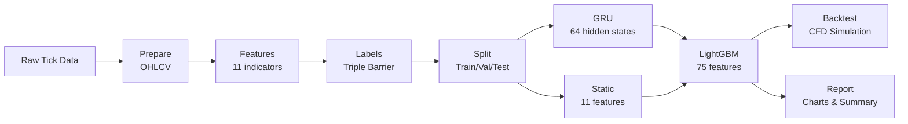
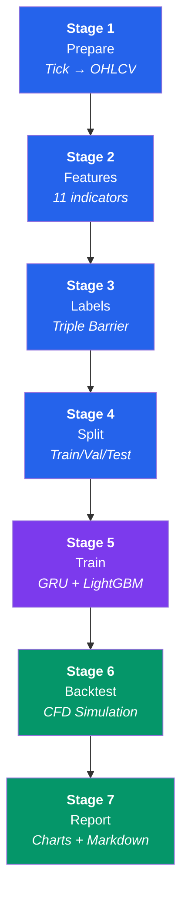
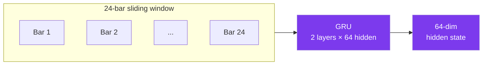
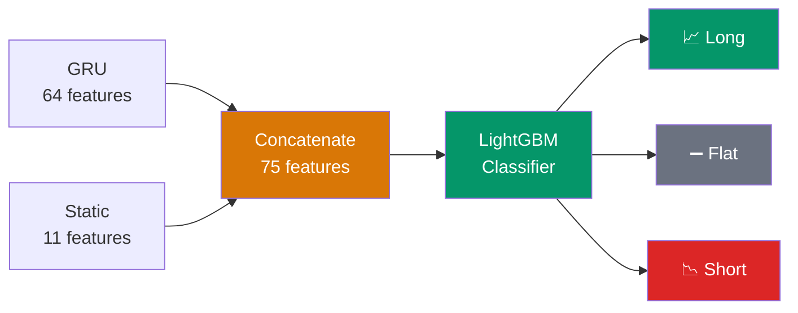
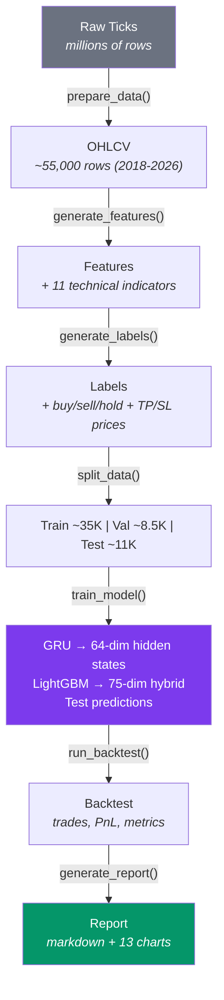
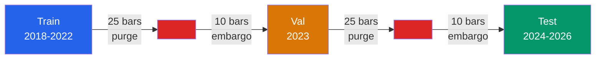
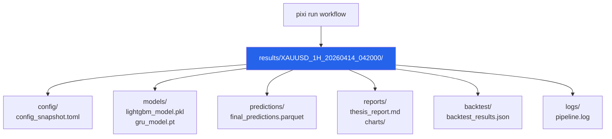

# Architecture

> A high-level overview of how this project is built.

---

## What Does This Project Do?

This project predicts **trading signals for gold (XAU/USD)** on the 1-hour timeframe.
It uses a **hybrid model** that combines two machine-learning approaches:

1. **GRU** (a type of neural network) — learns patterns from sequences of past prices.
2. **LightGBM** (a gradient-boosting tree model) — makes the final buy/sell/hold decision.

The output is a **backtest** — a simulation that shows how profitable the model's signals would have been in real trading.

---

## The Big Picture



---

## Pipeline Stages

The pipeline has **7 stages**. Each stage reads data, processes it, and saves the result.
You can run all stages at once or run them one by one.



| # | Stage | What It Does | Input | Output |
|---|-------|-------------|-------|--------|
| 1 | **Prepare** | Convert raw tick data into 1-hour candle (OHLCV) bars | Raw parquet ticks | `ohlcv.parquet` |
| 2 | **Features** | Calculate 11 technical indicators (RSI, ATR, MACD, etc.) | `ohlcv.parquet` | `features.parquet` |
| 3 | **Labels** | Generate buy/sell/hold labels using the Triple Barrier method | `features.parquet` | `labels.parquet` |
| 4 | **Split** | Split data into train, validation, and test sets with anti-leakage protection | `labels.parquet` | `train/val/test.parquet` |
| 5 | **Train** | Train GRU, then train LightGBM on combined features | Split parquets | Model files + predictions |
| 6 | **Backtest** | Simulate real CFD trading with costs, spreads, and risk management | Test data + predictions | `backtest_results.json` |
| 7 | **Report** | Generate charts and a summary markdown report | All outputs | Charts + `thesis_report.md` |

---

## The Hybrid Model (Stage 5)

This is the core innovation. Here is how it works step by step:

### Step 1: GRU Feature Extractor

The **GRU** (Gated Recurrent Unit) is a neural network that reads sequences of past prices.
Think of it like reading a sentence — it looks at the words one by one and builds an understanding of the whole context.



- **Input:** A sliding window of 24 hours of past data (log returns + RSI).
- **Output:** A 64-number vector (called "hidden states") that summarizes the temporal pattern.

### Step 2: LightGBM Decision Maker

**LightGBM** is a tree-based model (like a flowchart with many branches).
It takes the GRU's output plus the original 11 technical indicators and makes the final prediction.



- **Input:** 64 GRU hidden states + 11 static features = **75 features total**.
- **Output:** A prediction — **Long** (buy), **Short** (sell), or **Flat** (hold).

### Why Hybrid?

| Approach | Strength | Weakness |
|----------|----------|----------|
| GRU only | Captures time patterns | Misses indicator information |
| LightGBM only | Good with indicators | No sense of time order |
| **Hybrid** | **Captures both time + indicators** | More complex, slower to train |

---

## Key Design Decisions

| Decision | Reason |
|----------|--------|
| **GRU instead of LSTM** | Fewer parameters (25-30% less), less overfitting on small data |
| **No bidirectional GRU** | Prevents look-ahead bias (seeing future data) |
| **No attention mechanism** | Not needed for short 24-bar sequences |
| **LightGBM as the decision maker** | Better interpretability, handles mixed feature types |
| **Polars instead of Pandas** | 10-50x faster for time-series operations |
| **Session-based output folders** | Each run is isolated — easy to compare experiments |
| **Correlation filtering on train only** | Prevents data leakage from test set |
| **Purge and embargo at splits** | Prevents label leakage at train/test boundaries |
| **Triple Barrier labeling** | Realistic profit targets with a time limit |
| **CFD backtest with real costs** | Results are closer to real trading conditions |

---

## Project Structure

```
thesis/
├── config.toml              # All settings in one file
├── main.py                  # Entry point (CLI)
├── pixi.toml                # Package manager config
│
├── src/thesis/              # Source code
│   ├── config.py            # Loads config.toml
│   ├── prepare.py           # Tick data → OHLCV bars
│   ├── features.py          # 11 technical indicators
│   ├── labels.py            # Triple Barrier labels
│   ├── data.py              # Train/val/test splitting
│   ├── gru_model.py         # GRU neural network
│   ├── model.py             # Hybrid training (GRU + LightGBM)
│   ├── pipeline.py          # Orchestrates all stages
│   ├── backtest.py          # CFD trading simulator
│   ├── ablation.py          # Compare model variants
│   ├── report.py            # Markdown report generator
│   └── visualize.py         # 13 charts
│
├── tests/                   # Test suite
│   ├── conftest.py
│   ├── test_config.py
│   ├── unit/                # Unit tests per module
│   └── integration/         # End-to-end tests
│
├── data/
│   ├── raw/XAUUSD/          # Raw tick data (monthly files)
│   └── processed/           # Generated parquet files
│
├── results/                 # Session-based outputs
│   └── {TIMESTAMP}/
│       ├── config/          # Config snapshot
│       ├── models/          # Saved models
│       ├── predictions/     # Predictions (parquet)
│       ├── reports/         # Report + charts
│       ├── backtest/        # Trading results
│       └── logs/            # Pipeline log
│
└── docs/                    # Documentation (you are here)
```

---

## Data Flow

Here is what happens to the data at each step:



---

## Anti-Leakage Protection

Data leakage is when information from the future accidentally "leaks" into the training data.
This project uses **three layers** of protection:



1. **Purge** — Removes 25 bars at each split boundary to prevent overlap.
2. **Embargo** — Adds 10 extra bars of gap after each boundary.
3. **Correlation filtering on train only** — Feature selection uses only training data.

---

## Session-Based Output

Every time you run the pipeline, a new **session folder** is created:



This means:
- Old results are never overwritten.
- You can compare different parameter settings.
- Each session has its own log, config snapshot, and all outputs.
