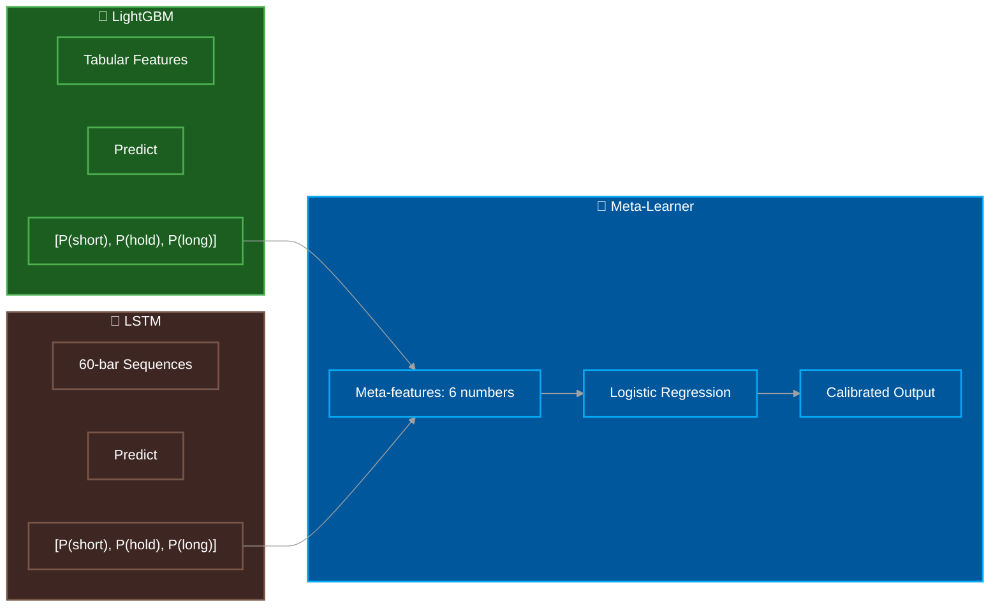
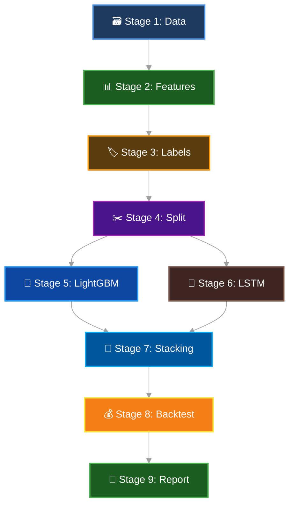

# Architecture: How This Project Works

## 🏗️ Big Picture

```mermaid
%%{init: {'theme': 'dark', 'themeVariables': { 'primaryColor': '#1e3a5f', 'primaryTextColor': '#fff', 'primaryBorderColor': '#4a90e2', 'lineColor': '#a0a0a0', 'secondaryColor': '#2d4a22', 'tertiaryColor': '#5c3d0f'}}}%%
flowchart TB
    subgraph Stage1["🗃️ Stage 1: DATA"]
        D1["Read ticks"]
        D2["Make H1 candles"]
        D3["Save to parquet"]
    end

    subgraph Stage2["📊 Stage 2: FEATURES"]
        F1["EMA (20,50,200)"]
        F2["RSI, MACD, ATR"]
        F3["Pivot points"]
        F4["Session hours"]
        F5["Lag features"]
    end

    subgraph Stage3["🏷️ Stage 3: LABELS"]
        L1["Triple-Barrier"]
        L2["TP = 2×ATR"]
        L3["SL = 1×ATR"]
        L4["10 bars horizon"]
        L5["3 classes"]
    end

    subgraph Stage4["✂️ Stage 4: SPLIT"]
        S1["Train: 2018-2022 (60%)"]
        S2["Val: 2023 (15%)"]
        S3["Test: 2024-2026 (25%)"]
    end

    subgraph Stage5["🌳 Stage 5: LIGHTGBM"]
        GB1["Tabular learning"]
        GB2["Optuna tuning"]
        GB3["Feature importance"]
    end

    subgraph Stage6["🧠 Stage 6: LSTM"]
        NN1["Sequential data"]
        NN2["60-bar sequences"]
        NN3["PyTorch CPU"]
    end

    subgraph Stage7["🎯 Stage 7: STACKING"]
        ST1["Combine both"]
        ST2["Meta-learner"]
        ST3["Calibrated"]
    end

    subgraph Stage8["💰 Stage 8: BACKTEST"]
        BT1["CFD simulation"]
        BT2["Real costs"]
        BT3["Equity curve"]
    end

    subgraph Stage9["📝 Stage 9: REPORTING"]
        R1["SHAP explainability"]
        R2["Performance metrics"]
        R3["Thesis markdown"]
    end

    Stage1 --> Stage2 --> Stage3 --> Stage4
    Stage4 --> Stage5 & Stage6
    Stage5 --> Stage7
    Stage6 --> Stage7
    Stage7 --> Stage8 --> Stage9

    classDef stage1 fill:#1e3a5f,stroke:#4a90e2,stroke-width:2px,color:#fff
    classDef stage2 fill:#1b5e20,stroke:#4caf50,stroke-width:2px,color:#fff
    classDef stage3 fill:#5c3d0f,stroke:#ff9800,stroke-width:2px,color:#fff
    classDef stage4 fill:#4a148c,stroke:#9c27b0,stroke-width:2px,color:#fff
    classDef stage5 fill:#0d47a1,stroke:#2196f3,stroke-width:2px,color:#fff
    classDef stage6 fill:#3e2723,stroke:#795548,stroke-width:2px,color:#fff
    classDef stage7 fill:#01579b,stroke:#03a9f4,stroke-width:2px,color:#fff
    classDef stage8 fill:#f57f17,stroke:#ffeb3b,stroke-width:2px,color:#fff
    classDef stage9 fill:#1b5e20,stroke:#4caf50,stroke-width:2px,color:#fff

    class Stage1,D1,D2,D3 stage1
    class Stage2,F1,F2,F3,F4,F5 stage2
    class Stage3,L1,L2,L3,L4,L5 stage3
    class Stage4,S1,S2,S3 stage4
    class Stage5,GB1,GB2,GB3 stage5
    class Stage6,NN1,NN2,NN3 stage6
    class Stage7,ST1,ST2,ST3 stage7
    class Stage8,BT1,BT2,BT3 stage8
    class Stage9,R1,R2,R3 stage9
```



## 📁 Code Structure

```
src/thesis/
├── __init__.py              # Package info
│
├── config/
│   ├── __init__.py
│   └── loader.py           # Read config.toml
│
├── data/
│   ├── tick_to_ohlcv.py    # Stage 1: Ticks → Candles
│   └── splitting.py        # Stage 4: Train/Val/Test split
│
├── features/
│   └── engineering.py      # Stage 2: Technical indicators
│
├── labels/
│   └── triple_barrier.py   # Stage 3: Label generation
│
├── models/
│   ├── lightgbm_model.py   # Stage 5: Tree model
│   ├── lstm_model.py       # Stage 6: Neural network
│   └── stacking.py         # Stage 7: Meta-learner
│
├── backtest/
│   └── cfd_simulator.py    # Stage 8: Trading simulation
│
├── reporting/
│   └── thesis_report.py    # Stage 9: Results & SHAP
│
└── pipeline/
    └── runner.py           # Connect all stages
```

## 🔄 Data Flow

### Step-by-Step:

**1. Input**: Dukascopy tick files
```
data/raw/XAUUSD/
├── 2018-01.parquet   (5M ticks)
├── 2018-02.parquet   (5M ticks)
├── ...
└── 2026-03.parquet
```

**2. Output Chain**:

```mermaid
flowchart LR
    %%{init: {'theme': 'dark', 'themeVariables': { 'primaryColor': '#1e3a5f', 'primaryTextColor': '#fff', 'primaryBorderColor': '#4a90e2', 'lineColor': '#a0a0a0'}}}%%
    T["🪶 Ticks"] --> O["📊 ohlcv.parquet"]
    O --> F["📈 features.parquet"]
    F --> L["🏷️ labels.parquet"]
    
    L --> TR["📗 train.parquet"]
    L --> V["📙 val.parquet"]
    L --> TE["📕 test.parquet"]
    
    TR --> LGBM["🌳 lightgbm_oof.parquet"]
    TE --> LGBM
    V --> LSTM["🧠 lstm_oof.parquet"]
    TE --> LSTM
    
    LGBM --> META["🎯 stacking_meta.pkl"]
    LSTM --> META
    
    META --> FINAL["🎯 final_predictions.parquet"]
    TE --> FINAL
    
    FINAL --> BT["💰 backtest_results.json"]
    BT --> RPT["📄 thesis_report.md"]
    
    classDef raw fill:#5c3d0f,stroke:#ff9800,stroke-width:2px,color:#fff
    classDef processed fill:#1e3a5f,stroke:#4a90e2,stroke-width:2px,color:#fff
    classDef features fill:#1b5e20,stroke:#4caf50,stroke-width:2px,color:#fff
    classDef labels fill:#f57f17,stroke:#ffeb3b,stroke-width:2px,color:#fff
    classDef split fill:#4a148c,stroke:#9c27b0,stroke-width:2px,color:#fff
    classDef model fill:#01579b,stroke:#03a9f4,stroke-width:2px,color:#fff
    classDef lstm fill:#3e2723,stroke:#795548,stroke-width:2px,color:#fff
    classDef meta fill:#00695c,stroke:#00bcd4,stroke-width:2px,color:#fff
    classDef output fill:#c62828,stroke:#f44336,stroke-width:2px,color:#fff
    classDef report fill:#1a237e,stroke:#3f51b5,stroke-width:2px,color:#fff
    
    class T raw
    class O processed
    class F features
    class L labels
    class TR,V,TE split
    class LGBM model
    class LSTM lstm
    class META meta
    class FINAL output
    class BT output
    class RPT report
```



## 🔧 Key Components

### 1. Config System (config.toml)
- One file controls everything
- Environment variables can override
- Example: THESIS_DATA__TIMEFRAME=30m

### 2. Data Processing
```python
# Tick → OHLCV
mid = (ask + bid) / 2
candle = {
    open: first(mid),
    high: max(mid),
    low: min(mid),
    close: last(mid),
    volume: sum(ask_vol + bid_vol)
}
```

### 3. Triple-Barrier Labels
```python
# For each candle:
tp = close + 2 * atr      # Take profit
sl = close - 1 * atr      # Stop loss

# Look ahead 10 bars:
if high hits tp first:  label = +1 (Long)
if low hits sl first:   label = -1 (Short)
if neither:             label = 0  (Hold)
```

### 4. Data Splitting (Market Regime Based)

Actual dates used:
- Train: 2018-01-01 to 2022-12-31 (60%)
- Validation: 2023-01-01 to 2023-12-31 (15%)
- Test: 2024-01-01 to 2026-03-31 (25%)

Important: Test period includes gold's 2024-2026 bull run (2065 to 4494 USD).

### 5. Model Stacking



### 6. LSTM Normalization (Anti-Leakage)

Fixed March 28, 2026:
```python
# Training: Calculate and save stats
norm_stats = {
    'train_means': means,
    'train_stds': stds
}
np.save('models/lstm_norm_stats.npz', **norm_stats)

# Testing: Load training stats (NOT test stats)
stats = np.load('models/lstm_norm_stats.npz')
X_test_norm = (X_test - stats['train_means']) / stats['train_stds']
```

This prevents data leakage from test set into predictions.

### 7. Backtest Realism
```python
# Trading costs included:
entry_price = price + spread/2 + slippage  # Buy
exit_price  = price - spread/2 - slippage  # Sell

# Account for:
- Spread (2 pips)
- Slippage (1 pip)
- Leverage (100:1)
- Max position: 2.0 lots
```

## 🧠 Why This Architecture?

| Choice | Reason |
|--------|--------|
| Polars | Fast for large tick data |
| LightGBM | Good for tabular features |
| LSTM | Captures price patterns |
| Stacking | Combines both strengths |
| Triple-Barrier | Realistic profit targets |
| Market Regime Split | Tests on gold bull run |

## 🎯 Cache System

Each stage checks: "Already done?"

```python
if output.exists() and not force_rerun:
    use_cached_file()   # Skip stage
else:
    run_stage()         # Generate file
```

This saves hours when re-running.

## 🔄 Pipeline Dependencies



If you run Stage 5, it auto-runs 1-4 first.

## 📊 Data Sizes

| File | Size | Rows |
|------|------|------|
| Raw ticks | ~500MB | 300M+ |
| OHLCV H1 | ~50MB | 52,000 |
| Features | ~80MB | 52,000 |
| Train set | ~35MB | 36,000 |
| Val set | ~8MB | 8,000 |
| Test set | ~8MB | 8,000 |

## 🔒 Security Notes

### Data Leakage Prevention
1. LSTM normalization uses training stats only (saved to models/lstm_norm_stats.npz)
2. Triple-barrier uses forward-looking bars (no future info in features)
3. Lag features use .shift() (no lookahead)
4. Pivot points use previous day's data with .shift(1)

### Purge and Embargo
```toml
[splitting]
purge_bars = 15      # Remove 15 bars around split
embargo_bars = 10    # Additional safety margin
```

---

Next: See Quickstart.md to run it!
