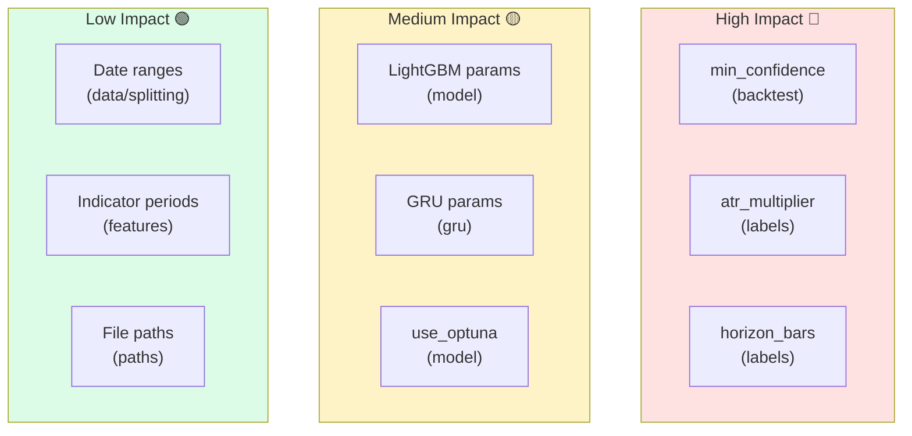
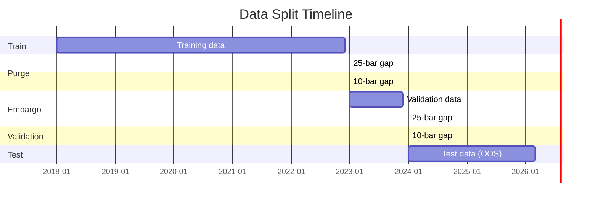
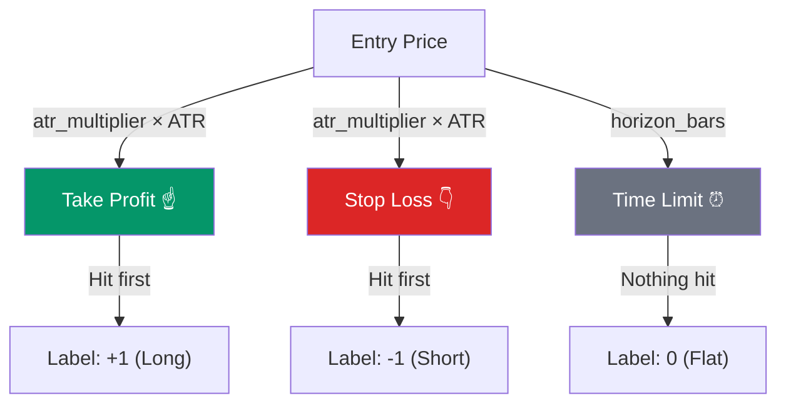
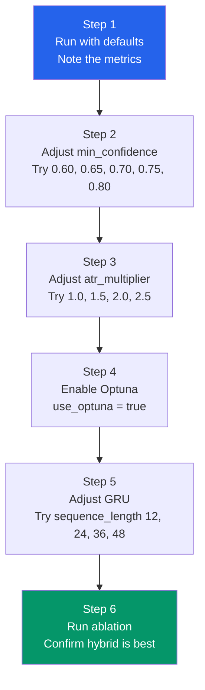

# Features & Configuration Guide

> First, understand what the model sees. Then, learn how to tune it.

---

## Part 1: Features — What the Model Sees

Before you change any settings, you need to understand **what data the model works with**.
The model uses **75 features** in total — 64 from the GRU and 11 static technical indicators.

```mermaid
flowchart LR
    subgraph GRU_INPUT["GRU Input (per bar)"]
        LR["log_returns"]
        RSI["rsi_14"]
    end

    subgraph GRU_SEQ["24-bar window"]
        B1["Bar 1"]
        B2["Bar 2"]
        BD["..."]
        B24["Bar 24"]
    end

    GRU_INPUT --> GRU_SEQ
    GRU_SEQ --> GRU["GRU<br/>2 layers × 64 hidden"]
    GRU --> HS["64 hidden states"]

    subgraph STATIC["Static Features"]
        F1["rsi_14"]
        F2["atr_14"]
        F3["macd_hist"]
        F4["atr_ratio"]
        F5["price_dist_ratio"]
        F6["pivot_position"]
        F7["atr_percentile"]
        F8["sess_asia"]
        F9["sess_london"]
        F10["sess_overlap"]
        F11["sess_ny_pm"]
    end

    HS --> LGBM["LightGBM<br/>75 features"]
    STATIC --> LGBM
    LGBM --> PRED["Long / Flat / Short"]

    style GRU fill:#7C3AED,color:#fff
    style LGBM fill:#059669,color:#fff
    style PRED fill:#2563EB,color:#fff
```



---

### Static Features (11 indicators)

These are calculated directly from price data. Each bar (1 hour) has these 11 values.

| # | Feature Name | What It Measures | Why It Matters |
|---|-------------|-----------------|---------------|
| 1 | **rsi_14** | Relative Strength Index (14-bar). Measures if price moved too fast in one direction. | Values above 70 = overbought. Below 30 = oversold. |
| 2 | **atr_14** | Average True Range (14-bar). Measures how much price moves per bar on average. | High ATR = volatile market. Low ATR = calm market. |
| 3 | **macd_hist** | MACD Histogram. The difference between MACD line and signal line. | Positive = upward momentum. Negative = downward momentum. |
| 4 | **atr_ratio** | Short-term ATR (5) divided by long-term ATR (20). | Above 1 = volatility increasing. Below 1 = volatility decreasing. |
| 5 | **price_dist_ratio** | How far the current price is from the 89-bar EMA, normalized by ATR. | Positive = price above average. Negative = price below average. |
| 6 | **pivot_position** | Where the price sits between support (S1) and resistance (R1) levels. | 0 = at support. 1 = at resistance. 0.5 = middle. |
| 7 | **atr_percentile** | Where the current ATR ranks among the last 50 bars (0 to 1). | High = unusually volatile. Low = unusually calm. |
| 8 | **sess_asia** | Is this bar in the Asian trading session? (1 or 0) | Asian session tends to have lower volatility. |
| 9 | **sess_london** | Is this bar in the London morning session? (1 or 0) | London session often has strong moves. |
| 10 | **sess_overlap** | Is this bar in the London-New York overlap? (1 or 0) | Highest volume and volatility. |
| 11 | **sess_ny_pm** | Is this bar in the New York afternoon? (1 or 0) | Often has reversals or continuation of morning moves. |

> **Note:** Session times are based on New York timezone and adjust for daylight saving time automatically.

### GRU Features (64 hidden states)

The GRU reads a sliding window of **24 consecutive bars** and produces a **64-number summary**.
Its input is only two features per bar:

| # | Feature | What It Is |
|---|---------|-----------|
| 1 | **log_returns** | Percentage change in price from one bar to the next |
| 2 | **rsi_14** | The same RSI used as a static feature |

The GRU's 64 hidden states capture **temporal patterns** — like trends, reversals, and cycles — that individual indicators cannot see.

### Full Feature Space

```
64 GRU hidden states  +  11 static indicators  =  75 total features
```

LightGBM receives all 75 features and decides: Long, Flat, or Short.

---

## Part 2: Configuration Guide

All settings are in **`config.toml`**. This guide explains every section.

### Parameter Impact Map



---

### `[data]` — Data Settings

```toml
[data]
symbol = "XAUUSD"              # Trading instrument
timeframe = "1H"               # Candle timeframe
market_tz = "America/New_York" # Timezone for session calculations
start_date = "2018-01-01"      # Data start
end_date = "2026-03-31"        # Data end
tick_size = 0.01               # Minimum price movement
contract_size = 100            # Ounces per contract
```

| Parameter | What to Change | Effect |
|-----------|---------------|--------|
| `timeframe` | Try `"30min"` or `"4H"` | Changes how much data each bar represents. Smaller = more bars, noisier. Larger = fewer bars, smoother. |
| `start_date` / `end_date` | Adjust date range | More data = better training, but old data may be less relevant. |
| `market_tz` | Change if trading a different asset | Affects session dummy calculations. |

---

### `[splitting]` — Data Split

```toml
[splitting]
train_start = "2018-01-01"
train_end = "2022-12-31 23:59:59"
val_start = "2023-01-01"
val_end = "2023-12-31 23:59:59"
test_start = "2024-01-01"
test_end = "2026-03-31 23:59:59"
purge_bars = 25
embargo_bars = 10
```



| Parameter | What to Change | Effect |
|-----------|---------------|--------|
| Date ranges | Shift the boundaries | More training data = better model, but less test data = less reliable evaluation. |
| `purge_bars` | Increase for more safety | Removes more data at split boundaries to prevent leakage. Default 25 = 25 hours gap. |
| `embargo_bars` | Increase for more safety | Extra gap after purge. Default 10 = 10 hours additional gap. |

> **Tip:** Never make the test period too short. At least 6 months of data is recommended for a meaningful backtest.

---

### `[features]` — Technical Indicators

```toml
[features]
rsi_period = 14
atr_period = 14
macd_fast = 12
macd_slow = 26
macd_signal = 9
correlation_threshold = 0.90
```

| Parameter | What to Change | Effect |
|-----------|---------------|--------|
| `rsi_period` | Shorter (e.g., 7) for faster signals | Shorter RSI reacts faster but is noisier. |
| `atr_period` | Shorter for faster volatility detection | Affects TP/SL sizing and volatility features. |
| `macd_fast` / `macd_slow` / `macd_signal` | Standard values work well | MACD is less sensitive to changes than RSI. |
| `correlation_threshold` | Lower (e.g., 0.80) to drop more features | Removes features that carry similar information. A lower value means fewer features survive. |

---

### `[labels]` — Triple Barrier

```toml
[labels]
atr_multiplier = 1.5
horizon_bars = 10
num_classes = 3
min_atr = 0.0001
```



| Parameter | What to Change | Effect |
|-----------|---------------|--------|
| `atr_multiplier` | **Higher (e.g., 2.0)** = wider TP/SL, fewer but bigger trades | This controls how far the take-profit and stop-loss are from the entry price. |
| `horizon_bars` | **Higher (e.g., 15)** = more time for price to reach TP/SL | The maximum number of bars to wait. If neither barrier is hit, the label is "Flat". |
| `min_atr` | Rarely needs changing | A floor value for ATR to prevent tiny TP/SL on very calm markets. |

> **Biggest impact:** `atr_multiplier` and `horizon_bars` directly control the trading style. Low multiplier + short horizon = scalping. High multiplier + long horizon = swing trading.

---

### `[model]` — LightGBM Parameters

```toml
[model]
use_optuna = false
optuna_trials = 50
num_leaves = 92
max_depth = 6
learning_rate = 0.02
n_estimators = 198
min_child_samples = 100
subsample = 0.79
subsample_freq = 5
feature_fraction = 0.69
reg_alpha = 0.025
reg_lambda = 4.6
early_stopping_rounds = 50
```

| Parameter | What It Does | What to Try |
|-----------|-------------|------------|
| `num_leaves` | How many leaf nodes each tree can have | More = more complex model (risk of overfitting). Try 50-150. |
| `max_depth` | Maximum depth of each tree | Deeper = more complex. Try 4-8. |
| `learning_rate` | How fast the model learns | Lower = slower but more robust. Try 0.01-0.05. |
| `n_estimators` | Number of trees | More = better fit (with early stopping). Try 100-500. |
| `min_child_samples` | Minimum samples per leaf | Higher = more conservative (less overfitting). Try 50-200. |
| `subsample` | Fraction of data used per tree | Lower = more random (less overfitting). Try 0.6-1.0. |
| `feature_fraction` | Fraction of features used per tree | Lower = more diverse trees. Try 0.5-0.8. |
| `reg_alpha` | L1 regularization | Higher = simpler model. Try 0-0.1. |
| `reg_lambda` | L2 regularization | Higher = simpler model. Try 1-10. |
| `use_optuna` | Set to `true` to auto-tune parameters | Automatically searches for the best hyperparameters. |

> **Beginner tip:** Start with the defaults. If the model overfits (train accuracy much higher than test), increase `min_child_samples`, decrease `num_leaves`, or increase regularization. If the model underfits, do the opposite.

---

### `[gru]` — GRU Neural Network

```toml
[gru]
input_size = 2
hidden_size = 64
num_layers = 2
sequence_length = 24
dropout = 0.3
learning_rate = 0.001
batch_size = 64
epochs = 50
patience = 10
```

| Parameter | What It Does | What to Try |
|-----------|-------------|------------|
| `hidden_size` | Size of the GRU's internal memory | Larger = more capacity (64 or 128). Smaller = faster training. |
| `num_layers` | Number of stacked GRU layers | 1-3 is typical. More layers = deeper patterns but slower. |
| `sequence_length` | How many past bars the GRU looks at | 12-48 is reasonable. More = longer memory but more computation. |
| `dropout` | Randomly disables neurons during training | 0.2-0.5 is typical. Prevents overfitting. |
| `learning_rate` | How fast the GRU weights update | 0.001 is standard. Try 0.0005 for more stable training. |
| `batch_size` | Number of sequences processed at once | 32-128. Lower = less memory. Higher = faster but less stable. |
| `epochs` | Maximum training rounds | 30-100. Early stopping will stop earlier if no improvement. |
| `patience` | How many epochs to wait before stopping | 5-15. Lower = stop faster. Higher = wait longer. |

---

### `[backtest]` — Trading Simulator

```toml
[backtest]
initial_capital = 100000.0
leverage = 100
risk_per_trade = 0.01
spread_pips = 2.0
commission_per_lot = 7.0
margin_call_level = 0.5
stop_out_level = 0.2
min_confidence = 0.686
min_hold_bars = 3
atr_stop_multiplier = 1.5
```

| Parameter | What It Does | What to Try |
|-----------|-------------|------------|
| `initial_capital` | Starting money | Change to test different account sizes. Does not affect the model. |
| `leverage` | How much borrowed money you use | 100 = 1:100 leverage. Lower (e.g., 50) = less risk but smaller returns. |
| `risk_per_trade` | What fraction of capital to risk per trade | 0.01 = 1%. Lower = safer. Higher = more aggressive. |
| `spread_pips` | Broker's spread cost | 2.0 is typical for XAU/USD. Higher = more realistic for retail brokers. |
| `commission_per_lot` | Commission per standard lot round-trip | $7 is typical. Higher = more conservative. |
| `min_confidence` | Minimum prediction confidence to take a trade | **This is the most sensitive parameter.** Lower = more trades but more mistakes. Higher = fewer but better trades. Try 0.60-0.80. |
| `min_hold_bars` | Minimum hours before exiting a trade | Prevents whipsaw. 3 = at least 3 hours. |
| `atr_stop_multiplier` | Stop-loss distance as a multiple of ATR | Higher = wider stop (more room). Lower = tighter stop (cut losses faster). |

> **Most impactful parameter:** `min_confidence`. This single knob controls how selective the model is. Start at 0.70 and adjust:
> - Too few trades? Lower it to 0.60-0.65.
> - Too many bad trades? Raise it to 0.75-0.80.

---

### `[workflow]` — Pipeline Control

```toml
[workflow]
run_data_pipeline = true
run_feature_engineering = true
run_label_generation = true
run_data_splitting = true
run_model_training = true
run_backtest = true
run_reporting = true
force_rerun = false
random_seed = 2024
n_jobs = -1
```

| Parameter | What It Does |
|-----------|-------------|
| `run_*` toggles | Turn individual stages on/off. Set to `false` to skip. |
| `force_rerun` | Set to `true` to re-run everything even if outputs exist. |
| `random_seed` | Controls reproducibility. Same seed = same results. |
| `n_jobs` | Number of CPU cores. `-1` = use all cores. |

---

### `[paths]` — File Locations

```toml
[paths]
data_raw = "data/raw/XAUUSD"
data_processed = "data/processed"
ohlcv = "data/processed/ohlcv.parquet"
features = "data/processed/features.parquet"
labels = "data/processed/labels.parquet"
train_data = "data/processed/train.parquet"
val_data = "data/processed/val.parquet"
test_data = "data/processed/test.parquet"
```

You usually do not need to change these unless you are reorganizing the project structure.

---

## Tuning Strategy for Beginners

If you are new to machine learning and do not know where to start, follow this order:



### Step 1: Run with Defaults
Run the pipeline once with default settings. Note the metrics.

### Step 2: Adjust Confidence Threshold
Change `min_confidence` in `[backtest]`. Try 0.60, 0.65, 0.70, 0.75, 0.80. See which gives the best Sharpe ratio.

### Step 3: Adjust Label Parameters
Try different `atr_multiplier` values (1.0, 1.5, 2.0, 2.5). This changes the trading style.

### Step 4: Use Optuna
Set `use_optuna = true` in `[model]`. This automatically finds the best LightGBM parameters.

### Step 5: Adjust GRU
Change `sequence_length` (12, 24, 36, 48). This changes how far back the model looks.

### Step 6: Compare with Ablation
Run `pixi run ablation` after each experiment. Make sure the hybrid model is still better than individual models.

---

## What NOT to Change

These settings are carefully chosen and rarely need adjustment:

- `market_tz` — Session calculations depend on this.
- `purge_bars` / `embargo_bars` — Lowering these risks data leakage.
- `num_classes` — Must be 3 (Long, Flat, Short).
- `input_size` — Must match the number of GRU input features (2).
- `correlation_threshold` — Values above 0.95 let too many redundant features through.
