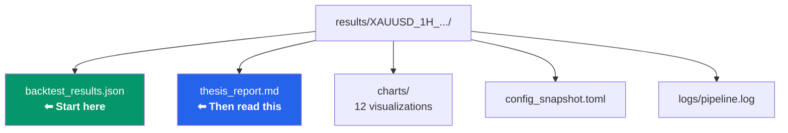
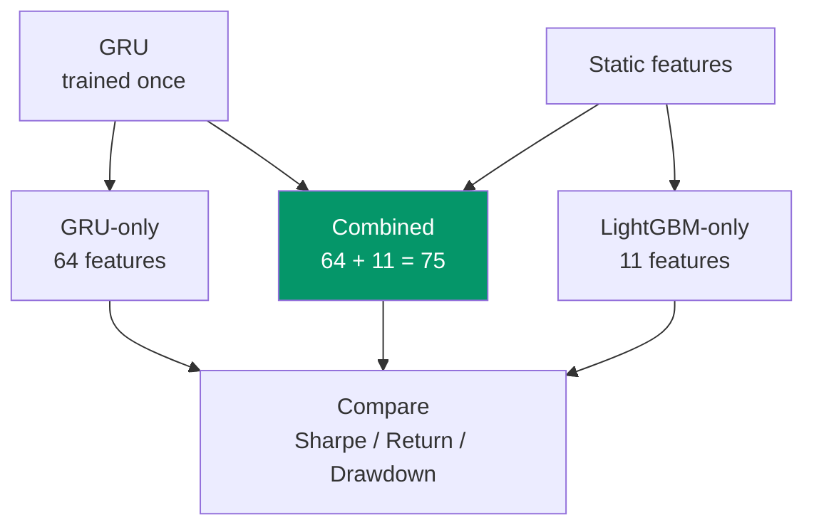

# Evaluation Guide

> A beginner-friendly guide on how to read and understand your results.

---

## Where to Find Results

After running `pixi run workflow`, everything is saved to a timestamped folder:

```
results/XAUUSD_1H_20260414_042000/
```



The two most important files are:

| File | What to Look At |
|------|----------------|
| `backtest/backtest_results.json` | All the numbers (metrics) |
| `reports/thesis_report.md` | Written summary with charts |

---

## The Metrics — Explained Simply

Here is every metric the backtest calculates, explained in plain language.

### Trading Activity

| Metric | What It Means |
|--------|--------------|
| **num_trades** | How many trades the model took in the test period. More trades = more data to evaluate, but also more costs. |
| **exposure_time_pct** | What percentage of the time the strategy was in a position. |
| **avg_trade_duration** | How long the average trade lasts (hours). |

> **A healthy model** has a reasonable number of trades (not too few, not too many). If your model trades only 5 times in 2 years, that is too few to be statistically meaningful.

---

### Win Rate

| Metric | What It Means |
|--------|--------------|
| **win_rate** | What percentage of all trades were profitable. |
| **long_win_rate** | Win rate for "buy" trades only. |
| **short_win_rate** | Win rate for "sell" trades only. |

> **How to read it:** If `win_rate = 0.55`, it means 55% of trades made money.
>
> **Important:** A high win rate alone does not mean the model is good. If wins are tiny and losses are huge, the model still loses money. Always look at win rate together with **profit factor** and **total return**.

---

### Money Metrics

| Metric | What It Means | Good Range |
|--------|--------------|------------|
| **return_pct** | Total percentage return on the starting capital. | Above 5% per test period |
| **profit_factor** | How much money you made vs. how much you lost. | Above 1.5 is decent, above 2.0 is good |
| **equity_final** | Final account balance. | Above initial_capital |
| **commissions** | Total commission paid across all trades. | Should not exceed total PnL |
| **expectancy_pct** | Average return you expect per trade. | Positive = good |

#### Profit Factor — The Most Important Metric

```
Profit Factor = Total Wins ($) / Total Losses ($)
```

| Value | Meaning |
|-------|---------|
| Below 1.0 | **Losing money.** The model is worse than random. |
| 1.0 - 1.5 | **Break-even zone.** Barely profitable after costs. |
| 1.5 - 2.0 | **Decent.** The model has a real edge. |
| Above 2.0 | **Good.** Strong edge, robust performance. |
| Above 3.0 | **Suspicious.** Probably overfitted — be careful. |

> **Why is 3.0 suspicious?** In real markets, it is very hard to maintain a 3:1 win-to-loss ratio consistently. If you see this, check if your backtest has a bug or if the model memorized the training data.

---

### Risk Metrics

| Metric | What It Means | Good Range |
|--------|--------------|------------|
| **max_drawdown_pct** | The worst peak-to-trough drop in your account. | Below 20% is comfortable |
| **sharpe_ratio** | Risk-adjusted return. Higher = better returns per unit of risk. | Above 1.0 is decent, above 2.0 is very good |
| **sortino_ratio** | Like Sharpe, but only counts **downside** risk. | Above 1.5 is good |
| **calmar_ratio** | Return divided by max drawdown. | Above 1.0 is reasonable |
| **sqn** | System Quality Number. Measures trade distribution quality. | Above 1.5 is good |
| **kelly_criterion** | Optimal fraction of capital to risk per trade. | Positive = edge exists |

#### Sharpe Ratio — The Gold Standard

```
Sharpe Ratio = (Average Return - Risk-Free Rate) / Standard Deviation of Returns
```

| Value | Meaning |
|-------|---------|
| Below 0 | **Bad.** Losing money on a risk-adjusted basis. |
| 0 - 0.5 | **Mediocre.** Not worth the risk. |
| 0.5 - 1.0 | **Okay.** Marginal edge. |
| 1.0 - 2.0 | **Good.** Solid risk-adjusted returns. |
| Above 2.0 | **Very good.** Excellent return per unit of risk. |

> **Chill tip:** Think of Sharpe as "how smooth is your equity curve?" A Sharpe of 2.0 means your equity goes up in a relatively straight line. A Sharpe of 0.5 means your equity is a rollercoaster — even if the end result is profit.

#### Max Drawdown — How Much Pain?

```
Max Drawdown = Biggest drop from your highest account value
```

If your account grew to $120,000 and then dropped to $96,000, your max drawdown is:

```
(120,000 - 96,000) / 120,000 = 20%
```

> **Real-talk:** If your max drawdown is 40%, that means at some point you lost almost half your money. Ask yourself: would you emotionally survive that? Most people can't. Aim for below 20%.

---

### Other Metrics

| Metric | What It Means |
|--------|--------------|
| **buy_&_hold_return_pct** | How much you'd make just buying and holding gold. Benchmark. |
| **alpha_pct** | Excess return over buy & hold. Positive = model adds value. |
| **beta** | Correlation with buy & hold. Lower = more independent strategy. |
| **volatility_ann_pct** | Annualized volatility of returns. Lower = smoother equity. |
| **cagr_pct** | Compound annual growth rate. |

---

## Reading the Charts

The project generates **12 charts** in the session folder, plus an interactive Bokeh chart.

### Data Charts (`charts/data/`)

| Chart | What to Look For |
|-------|-----------------|
| `candlestick.png` | OHLC candlestick chart with volume. Make sure the data looks normal — no huge gaps or spikes. |
| `label_distribution.png` | Check if the three classes (Long/Flat/Short) are balanced. If one class dominates (>70%), the model may struggle. |
| `feature_correlation.png` | Look for very dark red squares — these mean two features carry almost the same information. |
| `feature_distributions.png` | Each feature should have a reasonable shape (not all zeros, no extreme outliers). |

### Model Charts (`charts/model/`)

| Chart | What to Look For |
|-------|-----------------|
| `confusion_matrix.png` | The diagonal should be bright (correct predictions). Off-diagonal = mistakes. |
| `confidence_distribution.png` | Good models show high confidence for correct predictions and low confidence for wrong ones. |
| `feature_importance.png` | Shows which features matter most. GRU features (purple) vs. static features (blue). |

### Backtest Charts (`charts/backtest/`)

| Chart | What to Look For |
|-------|-----------------|
| `equity_drawdown.png` | Equity curve with drawdown overlay. Should trend upward over time with manageable drawdowns. |
| `pnl_histogram.png` | Distribution of trade profits and losses. Wins should outweigh losses. |
| `monthly_returns.png` | Heatmap of monthly returns. Most months should be green. |
| `rolling_sharpe.png` | Rolling Sharpe ratio over a 30-trade window. Should stay above 0 consistently. |
| `duration_vs_pnl.png` | Scatter plot of trade duration vs profit. No strong patterns = good. |
| `backtest_chart.html` | Interactive Bokeh chart with equity, drawdown, and trade markers. Resampled to 2h for performance. |

### Additional Backtest Files

| File | What It Contains |
|------|-----------------|
| `backtest_results.json` | All metrics + trade list (JSON) |
| `trades_detail.csv` | Per-trade breakdown: entry/exit time, direction, PnL, commission, duration |
| `equity_curve.csv` | Running equity and drawdown percentage per trade |

---

## Reading the Confusion Matrix

The confusion matrix shows you **where the model makes mistakes**.

```
              Predicted
              Long   Flat   Short
Actual Long  [0.45] [0.30] [0.25]
Actual Flat  [0.15] [0.60] [0.25]
Actual Short [0.10] [0.20] [0.70]
```

- **Diagonal (top-left to bottom-right):** Correct predictions. Higher = better.
- **Off-diagonal:** Mistakes. The model confused one class for another.

> **What to check:**
> - Is the model confusing Long with Short? That is dangerous — it means the model buys when it should sell.
> - Is the "Flat" row high? That means the model is predicting Flat correctly but missing trading opportunities.
> - The model does not need to be perfect. Even 40% accuracy on a 3-class problem can be profitable if the winning trades are big enough.

---

## Ablation Study — Proving the Hybrid Works

The ablation study compares three variants:



| Variant | What It Uses | What to Expect |
|---------|-------------|----------------|
| **LightGBM only** | 11 static features | Decent baseline, misses time patterns |
| **GRU only** | 64 hidden states | Captures patterns but loses indicator info |
| **Combined** | 64 GRU + 11 static | Should be the best of both worlds |

### How to Read the Comparison

Look at `ablation_results.json`:

```json
{
  "lgbm_only": { "sharpe_ratio": 0.8, "total_return_pct": 5.2 },
  "gru_only":  { "sharpe_ratio": 0.6, "total_return_pct": 3.1 },
  "combined":  { "sharpe_ratio": 1.2, "total_return_pct": 8.7 }
}
```

> **If Combined wins:** The hybrid approach is justified — GRU and LightGBM complement each other.
>
> **If LightGBM only wins:** The GRU might be adding noise. Try adjusting GRU parameters or sequence length.
>
> **If GRU only wins:** The static features might be redundant. Check feature correlation and importance.

---

## Red Flags — When to Worry

| Red Flag | What It Probably Means |
|----------|----------------------|
| Sharpe ratio above 3.0 | Overfitting — the model memorized the data |
| Only 10-20 trades | Not enough data to draw conclusions |
| Win rate above 80% | Very likely overfitting |
| Max drawdown above 40% | Risk management is failing |
| Huge gap between train and test performance | Data leakage or overfitting |
| All predictions are "Flat" | Model is too conservative — check class balance in training data |
| Backtest return is negative but model accuracy is high | Costs (spread, commission) are eating all the profit |
| 0 trades in backtest | Position size too large for available margin — reduce lots_per_trade or increase leverage |

---

## Green Flags — When to Be Happy

| Green Flag | What It Means |
|-----------|--------------|
| Sharpe between 1.0 and 2.0 | Solid risk-adjusted returns |
| 200+ trades | Statistically meaningful sample |
| Max drawdown under 15% | Good risk control |
| Profit factor above 1.5 | Real, consistent edge |
| Monthly returns mostly green | Strategy works across market conditions |
| Ablation shows Combined > individual | Hybrid approach is validated |

---

## Quick Sanity Checklist

Run through this list after every experiment:

- [ ] Did the pipeline complete without errors?
- [ ] Is the test period long enough (at least 6 months)?
- [ ] Are there enough trades (at least 100)?
- [ ] Is the Sharpe ratio between 0.5 and 3.0?
- [ ] Is the max drawdown below 25%?
- [ ] Is the profit factor above 1.0?
- [ ] Does the equity curve go up over time?
- [ ] Does the ablation study confirm the hybrid is better?

If you can check all these boxes — nice work! You have a reasonable model.
