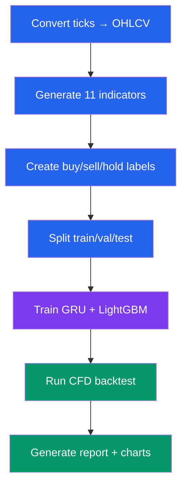
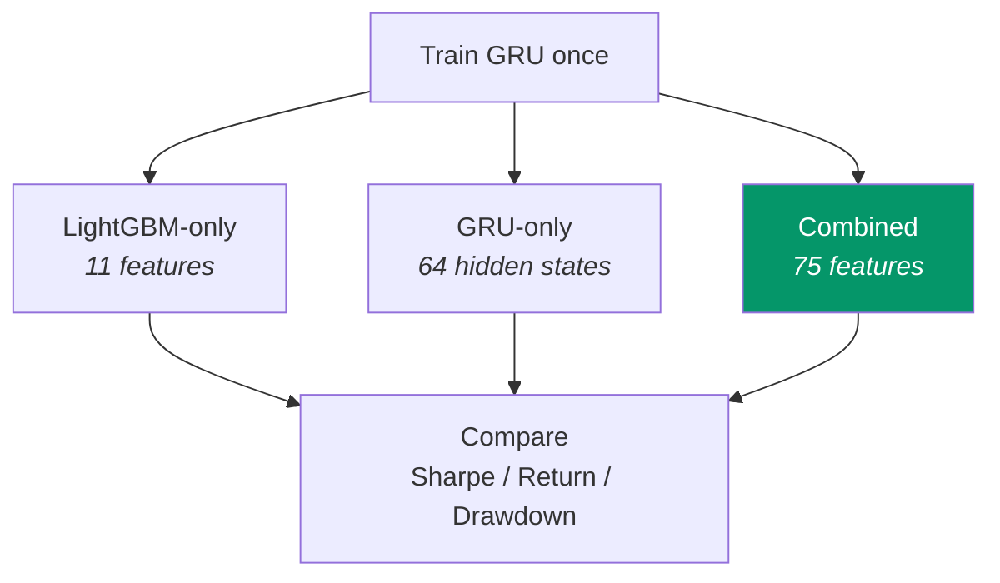

# Quickstart

> Step-by-step guide to run the project from scratch.

---

## Prerequisites

Before you begin, make sure you have:

- **Pixi** installed ([install guide](https://pixi.sh/latest/))
- **Git** installed
- **At least 2 GB of free disk space** (for data and models)
- **8 GB RAM minimum** (16 GB recommended for training)

---

## Setup Overview


---

## Step 1: Clone the Repository

```bash
git clone <your-repo-url> thesis
cd thesis
```

---

## Step 2: Install Dependencies

Pixi will download and install all required packages automatically:

```bash
pixi install
```

This creates an isolated environment with Python 3.13 and all libraries (PyTorch, LightGBM, Polars, etc.).

> **Note:** The first install may take a few minutes because it downloads PyTorch and other large packages.

---

## Step 3: Get the Data

Place your raw XAU/USD tick data in the correct folder:

```bash
data/raw/XAUUSD/
```

Each file should be a **parquet file** containing tick data for one month. The columns expected are:

| Column | Description |
|--------|-------------|
| `timestamp` | Date and time of the tick |
| `bid` | Bid price |
| `ask` | Ask price |

> Alternatively, use the built-in downloader:
> ```bash
> pixi run data
> ```
> This downloads XAU/USD data from 2018 onwards.

---

## Step 4: Run the Full Pipeline

The simplest command — runs everything from data preparation to report generation:

```bash
pixi run workflow
```

This command:



> **First run:** This may take 10-30 minutes depending on your hardware.
> **Subsequent runs:** Stages are cached — only changed stages re-run.

---

## Step 5: View the Results

After the pipeline finishes, look in the `results/` folder:

```bash
results/XAUUSD_1H_YYYYMMDD_HHMMSS/
```

### Key Files to Check

| File | What It Contains |
|------|-----------------|
| `reports/thesis_report.md` | Full written report with metrics and charts |
| `backtest/backtest_results.json` | Trading metrics (win rate, return, Sharpe, etc.) |
| `reports/charts/` | All 13 visualization charts |
| `config/config_snapshot.toml` | The exact config used for this run |
| `logs/pipeline.log` | Detailed execution log |

### Quick Look at Results

```bash
# View the report
cat results/*/reports/thesis_report.md

# View trading metrics
cat results/*/backtest/backtest_results.json

# List all charts
ls results/*/reports/charts/*/
```

---

## Step 6 (Optional): Run Ablation Study

The ablation study compares three model variants:

```bash
pixi run ablation
```



Results are saved to `ablation_results.json` in the session folder.

---

## Other Useful Commands

| Command | What It Does |
|---------|-------------|
| `pixi run force` | Re-run all stages (ignoring cache) |
| `pixi run test` | Run all tests with coverage |
| `pixi run lint` | Check code for style issues |
| `pixi run format` | Auto-format code |
| `pixi run clean-cache` | Delete processed data files |
| `pixi run clean-all` | Delete processed data + models + results |

---

## Running Individual Stages

If you want to run just one stage, use the `workflow` toggles in `config.toml`:

```toml
[workflow]
run_data_pipeline = false      # Skip data preparation
run_feature_engineering = true  # Run feature engineering
run_label_generation = false    # Skip label generation
run_data_splitting = false      # Skip splitting
run_model_training = true       # Run model training
run_backtest = true             # Run backtest
run_reporting = true            # Generate report
```

Then run:

```bash
pixi run workflow
```

Only the stages set to `true` will execute.

---

## Changing Settings

All settings live in **`config.toml`**. Edit this file to change:

- Date ranges (which years of data to use)
- Model parameters (learning rate, number of trees, etc.)
- Backtest parameters (capital, leverage, spread, etc.)
- GRU architecture (hidden size, layers, sequence length, etc.)

See the [Configuration Guide](CONFIGURATION.md) for detailed instructions.

---

## Troubleshooting

### "No module named 'thesis'"

Make sure you're using pixi to run commands:

```bash
pixi run workflow    # Correct
python main.py       # May not find the package
```

### "File not found: data/raw/XAUUSD/*.parquet"

You need raw tick data. Either:
1. Place parquet files manually in `data/raw/XAUUSD/`
2. Run `pixi run data` to download

### "CUDA out of memory"

The GRU training uses very little GPU memory. If you still see this error:

```toml
[gru]
batch_size = 32    # Reduce from 64 to 32
```

### "Pipeline says 'skipping' stages"

Stages are cached. To force re-run everything:

```bash
pixi run force
```

Or set in config.toml:

```toml
[workflow]
force_rerun = true
```

---

## Running Tests

```bash
# All tests with coverage
pixi run test

# Unit tests only
pixi run test-unit

# Integration tests only
pixi run test-integration

# Fast tests (skip slow ones)
pixi run test-fast

# Single test file
pixi run pytest tests/unit/test_features.py

# Single test function
pixi run pytest tests/unit/test_features.py::test_rsi_bounds
```

---

## Quick Command Reference

```bash
# === Setup ===
pixi install                    # Install all dependencies

# === Data ===
pixi run data                   # Download XAU/USD data

# === Pipeline ===
pixi run workflow               # Run full pipeline
pixi run force                  # Force re-run everything
pixi run ablation               # Pipeline + ablation study

# === Code Quality ===
pixi run lint                   # Check code style
pixi run format                 # Format code
pixi run pre-commit             # Lint + format + test

# === Testing ===
pixi run test                   # Run tests with coverage
pixi run test-unit              # Unit tests only
pixi run test-fast              # Skip slow tests

# === Cleanup ===
pixi run clean-cache            # Delete processed data
pixi run clean-all              # Delete everything generated
```
