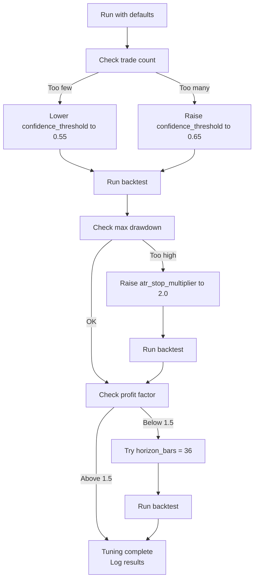

# Configuration Tuning Guide

> Practical guidance for achieving best results from the hybrid GRU + LightGBM model.

---

## Overview

This guide helps you adjust `config.toml` for different testing scenarios, timeframes, and goals. The pipeline has many parameters, but only a few have the biggest impact on results. This guide tells you **which parameters to tune first** and **what ranges to try**.

---

## 1. High-Impact Parameters

These parameters have the most effect on your backtest results. Adjust these before touching anything else.

### `horizon_bars` (labels)

| What it does | Maximum time window for a trade, in bars |
|--------------|----------------------------------------|
| **Default** | 24 |
| **Range** | 12–48 |
| **Effect** | Shorter = faster trades, more signals, higher costs. Longer = swing trading, fewer signals, larger moves. |

- **12–16 bars**: Scalping style. More trades, more costs, catches small moves.
- **24 bars** (default for 1H): Covers ~1–2 trading days. Balanced.
- **36–48 bars**: Swing style. Fewer trades, needs bigger moves to hit TP/SL.

> For XAU/USD on 1H, `horizon_bars = 24` is a good starting point. Increase to 36–48 for a more conservative, swing-trading approach.

---

### `confidence_threshold` (backtest)

| What it does | Minimum predicted probability before taking a trade |
|--------------|---------------------------------------------------|
| **Default** | 0.6 |
| **Range** | 0.0–0.9 |
| **Effect** | Higher = fewer but more confident trades. Lower = more signals, more noise. |

- **0.0**: Trade on ALL signals (ignore model confidence).
- **0.5**: Moderate confidence required.
- **0.6** (default): Balanced — only trade when model is at least 60% confident.
- **0.7–0.8**: Conservative — only high-confidence trades. Good for live trading.

> If your backtest has **too few trades** (< 100), try lowering to 0.5. If you see **too many small losses**, try raising to 0.65–0.7.

---

### `atr_stop_multiplier` (backtest)

| What it does | Stop-loss distance as a multiple of ATR |
|--------------|---------------------------------------|
| **Default** | 1.5 |
| **Range** | 0.5–3.0 |
| **Effect** | Lower = tighter stops, more stopped out, smaller losses per trade. Higher = wider stops, room for volatility, larger losses. |

- **0.5–1.0**: Very tight. Good for calm markets, but gets stopped out often in volatile periods.
- **1.5** (default): Balanced. Gives price room to move while limiting loss.
- **2.0–3.0**: Wide. For volatile markets or when you want to let trades develop.

> XAU/USD is volatile. During gold's bull run (2024–2026), ATR multiplies of 1.5–2.0 work better than tight stops.

---

### `sequence_length` (gru)

| What it does | How many past bars the GRU reads before predicting |
|--------------|---------------------------------------------------|
| **Default** | 48 |
| **Range** | 24–96 |
| **Effect** | Shorter = faster training, less context. Longer = more temporal context, slower training, risk of overfitting. |

- **24–32 bars**: Fast training, good for initial experiments.
- **48 bars** (default): ~2 trading days of context. Good balance.
- **64–96 bars**: Longer memory. Risk of overfitting on small datasets.

> For 1H timeframe, `sequence_length = 48` (2 days) is standard. For Daily, try 20–30. For 30min, try 96+.

---

### `hidden_size` (gru)

| What it does | Size of the GRU's internal memory (hidden states) |
|--------------|--------------------------------------------------|
| **Default** | 32 |
| **Range** | 16–64 |
| **Effect** | Larger = more capacity to learn complex patterns, but slower and more risk of overfitting. |

- **16–24**: Small datasets (< 2 years) or fast experiments.
- **32** (default): Balanced. Good for most datasets.
- **48–64**: Large datasets (> 5 years) with diverse market regimes.

> With 5 years of data and 48-bar sequences, `hidden_size = 32` is a safe default. Increase to 48–64 only if you have very rich data and training still underfits.

---

## 2. Timeframe-Specific Guidance

Different timeframes require different parameter values.

### For 30min Timeframe

| Parameter | Value | Why |
|-----------|-------|-----|
| `horizon_bars` | 48 | ~2 trading days of context |
| `sequence_length` | 96 | Covers weekend gaps better |
| `atr_stop_multiplier` | 1.5–2.0 | More noise at 30min, wider stops |
| `confidence_threshold` | 0.65 | Filter false signals |

### For 1H Timeframe (default)

| Parameter | Value | Why |
|-----------|-------|-----|
| `horizon_bars` | 24 | ~1–2 trading days |
| `sequence_length` | 48 | ~2 trading days of context |
| `atr_stop_multiplier` | 1.5 | Balanced for gold volatility |
| `confidence_threshold` | 0.6 | Default, balanced |

### For 4H Timeframe

| Parameter | Value | Why |
|-----------|-------|-----|
| `horizon_bars` | 12–18 | ~2–3 trading days |
| `sequence_length` | 24–36 | ~4–6 trading days |
| `atr_stop_multiplier` | 1.0–1.5 | Less noise at 4H |
| `confidence_threshold` | 0.55 | Still need enough trades |

### For Daily Timeframe

| Parameter | Value | Why |
|-----------|-------|-----|
| `horizon_bars` | 5–10 | ~1–2 weeks |
| `sequence_length` | 20–30 | ~1 month |
| `atr_stop_multiplier` | 2.0–3.0 | Let trades develop |
| `confidence_threshold` | 0.5 | Fewer bars, still need signals |

---

## 3. Dataset-Size Guidance

The amount of training data affects which parameters are safe to use.

### Small Dataset (< 2 years)

| Parameter | Adjustment | Why |
|-----------|------------|-----|
| `sequence_length` | Reduce to 24–32 | Less data to fill long sequences |
| `hidden_size` | Reduce to 16–24 | Fewer parameters to prevent overfitting |
| `correlation_threshold` | Increase to 0.85 | Keep more features |
| `min_child_samples` | Increase to 300+ | More conservative splits |
| `optuna_trials` | Reduce to 50 | Less data = faster overfitting |

### Medium Dataset (2–5 years)

| Parameter | Adjustment | Why |
|-----------|------------|-----|
| `sequence_length` | 48 (default) | Good balance |
| `hidden_size` | 32 (default) | Good balance |
| `correlation_threshold` | 0.75 (default) | Default filtering |
| `optuna_trials` | 100 (default) | Standard search depth |

### Large Dataset (> 5 years)

| Parameter | Adjustment | Why |
|-----------|------------|-----|
| `sequence_length` | 48–64 | Can afford longer context |
| `hidden_size` | 32–48 | More capacity for rich data |
| `correlation_threshold` | 0.70–0.75 | Can afford aggressive filtering |
| `optuna_trials` | 100–150 | Deeper search worth it |

---

## 4. Profiles for Different Goals

Choose a profile based on your goal and risk tolerance.

### Conservative Profile

> Fewer trades, lower drawdown, suitable for **live trading** or **small accounts**.

```toml
confidence_threshold = 0.70
atr_stop_multiplier = 2.0
horizon_bars = 36
auto_lot_sizing = true
risk_per_trade_pct = 0.5
min_lot_size = 0.1
```

**Expected behavior**: 30–50% fewer trades, lower max drawdown, smoother equity curve.

---

### Balanced Profile (Default)

> Default settings that work well for XAU/USD 1H with 5+ years of data.

```toml
confidence_threshold = 0.6
atr_stop_multiplier = 1.5
horizon_bars = 24
auto_lot_sizing = true
risk_per_trade_pct = 1.0
```

**Expected behavior**: Good balance of trades and quality. Default recommendation.

---

### Aggressive Profile

> More trades, higher potential return, higher drawdown risk. For **larger accounts** with **higher risk tolerance**.

```toml
confidence_threshold = 0.50
atr_stop_multiplier = 1.0
horizon_bars = 16
auto_lot_sizing = true
risk_per_trade_pct = 2.0
```

**Expected behavior**: 50–80% more trades, higher return potential but also higher drawdown. Monitor closely.

---

## 5. Tuning Priority Order

When optimizing, adjust parameters in this order. Each step builds on the previous.

1. **`horizon_bars`** — Most impact on label quality. Start here.
2. **`confidence_threshold`** — Controls trade frequency. Adjust for your account size.
3. **`atr_stop_multiplier`** — Direct impact on risk/reward ratio.
4. **`sequence_length`** — GRU context. Adjust for your timeframe.
5. **`hidden_size`** — GRU capacity. Adjust for your dataset size.
6. **`correlation_threshold`** — Feature set. Adjust if feature count is too low/high.
7. **LightGBM params** — Fine-tune after above are stable (`max_depth`, `min_child_samples`, `learning_rate`).

---

## 6. Common Pitfalls

Avoid these mistakes:

| Mistake | Why It's Bad | Fix |
|---------|--------------|-----|
| `horizon_bars` too short (5–10) | Labels become noise — price has no time to reach TP/SL | Minimum 12 for 1H, 16+ for 30min |
| `confidence_threshold` too low (0.3) | Too many false signals, poor win rate | Minimum 0.5, prefer 0.6+ |
| `atr_stop_multiplier` too tight (0.5) | Constantly stopped out by normal volatility | Minimum 1.0, prefer 1.5+ |
| `sequence_length` too long (100+) | GRU overfits to training data | Maximum 64 for small data, 96 for large |
| `correlation_threshold` too high (0.95) | Redundant features add noise, slow training | Keep at 0.75 or lower |
| `hidden_size` too large on small data | GRU memorizes instead of generalizes | Use 16–24 for < 2 years data |
| Not using `auto_lot_sizing` with large accounts | Fixed lots create unrealistic position sizes | Enable `auto_lot_sizing = true` |

---

## 7. Quick Reference Tables

### ATR Multiplier by Market Volatility

| Market Condition | `atr_stop_multiplier` | `atr_profit_multiplier` |
|------------------|----------------------|------------------------|
| Calm (low ATR) | 1.0–1.5 | 1.5–2.0 |
| Normal | 1.5 (default) | 2.0–2.5 |
| Volatile (high ATR) | 2.0–2.5 | 2.5–3.0 |

### Confidence Threshold by Account Size

| Account Size | `confidence_threshold` | `risk_per_trade_pct` |
|--------------|----------------------|---------------------|
| < $5,000 | 0.65–0.70 | 0.5–1.0% |
| $5,000–$20,000 | 0.60–0.65 | 1.0–1.5% |
| > $20,000 | 0.55–0.60 | 1.5–2.0% |

---

## 8. Monitoring and Iteration

After running a backtest:

1. **Check trade count**: < 100 trades = not statistically meaningful. Adjust `confidence_threshold` or `horizon_bars`.
2. **Check max drawdown**: > 25% is risky for most traders. Increase `confidence_threshold` or widen `atr_stop_multiplier`.
3. **Check win rate**: Should be above 50% ideally, but profit factor matters more.
4. **Check profit factor**: Above 1.5 is good. Above 2.0 is excellent but be suspicious of > 3.0 (possible overfitting).
5. **Compare to buy & hold**: Your alpha (excess return over buy & hold) should be positive.

---

## 9. Example Tuning Workflow



---

## Summary

| Parameter | Default | Range | Key Use |
|-----------|---------|-------|---------|
| `horizon_bars` | 24 | 12–48 | Trade duration |
| `confidence_threshold` | 0.6 | 0.0–0.9 | Trade frequency |
| `atr_stop_multiplier` | 1.5 | 0.5–3.0 | Risk management |
| `sequence_length` | 48 | 24–96 | GRU context |
| `hidden_size` | 32 | 16–64 | GRU capacity |
| `correlation_threshold` | 0.75 | 0.5–0.95 | Feature selection |
