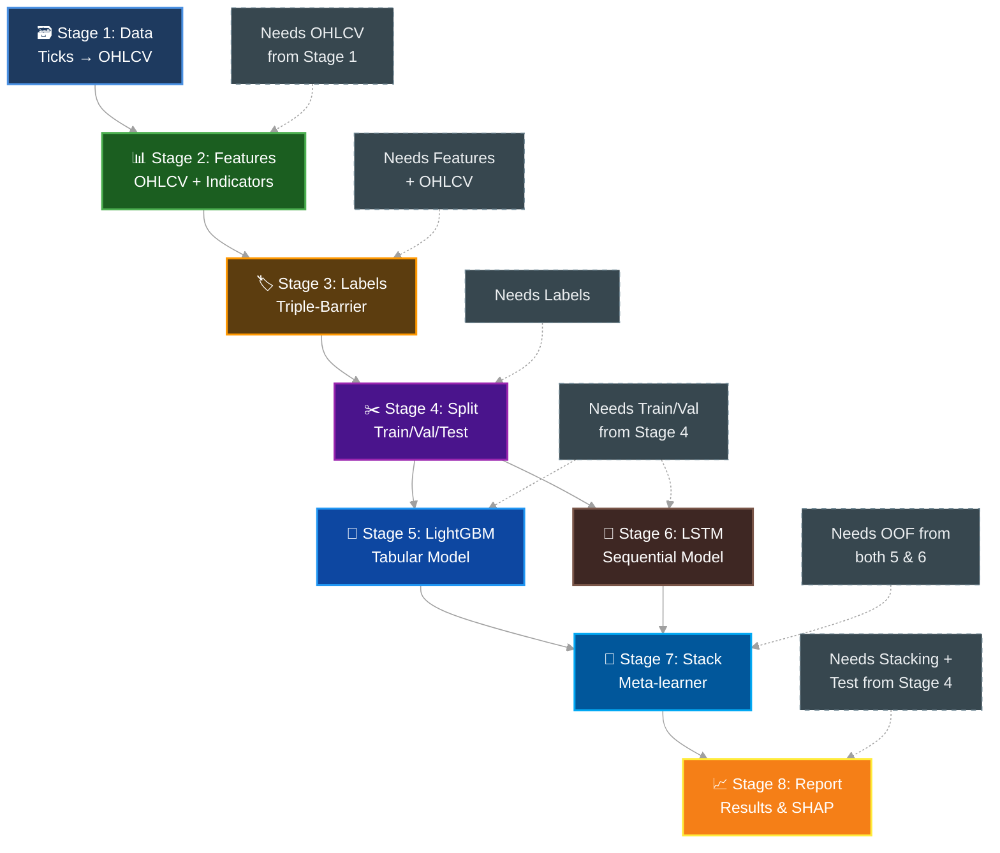

# Implementation Plan: Hybrid Stacking (LSTM + LightGBM) for XAU/USD H1 Trading Signals

> Bachelor's Thesis - Thuy Loi University  
> Student: Nguyen Duc Hieu | Advisor: Hoang Quoc Dung  
> Timeline: 23 Mar – 28 Jun 2026 (10 weeks)

---

## 1. Simple Project Structure

```
thesis/
├── main.py                      # Entry point
├── config.toml                  # All settings in one place
├── src/thesis/
│   ├── config.py               # Load settings
│   ├── stages/                 # 8 pipeline stages
│   │   ├── __init__.py
│   │   ├── stage1_data.py      # Raw → OHLCV
│   │   ├── stage2_features.py  # Add indicators
│   │   ├── stage3_labels.py    # Triple-Barrier
│   │   ├── stage4_split.py     # Train/Val/Test
│   │   ├── stage5_lightgbm.py  # First model
│   │   ├── stage6_lstm.py      # Second model
│   │   ├── stage7_stack.py     # Combine models
│   │   └── stage8_report.py    # Results + charts
│   └── utils.py                # Helper functions
└── data/
    ├── raw/XAUUSD/             # Your 99 files
    └── processed/              # Auto-created outputs
```

---

## 2. The 8-Stage Pipeline (Step by Step)

### Stage 1: From Raw Ticks to OHLCV (H1 Candles)

**What this stage does:**
- Reads your 99 parquet files (one per month, 2018-01 to 2026-03)
- Combines them into one dataset
- Creates H1 candles (1 candle per hour) from tick data
- Removes weekends (no trading on Saturday/Sunday)
- Sets day boundary at 17:00 New York time (market close)

**Example:**
```
Input:  5,300,000 ticks in 2018-01.parquet
         (timestamp, ask, bid, ask_volume, bid_volume)

Output: ~744 OHLCV candles (January has ~31 days × 24 hours)
         (timestamp, open, high, low, close, volume)
```

**Code pattern:**
```python
def run():
    # Skip if already done
    if file_exists("data/processed/ohlcv.parquet"):
        print("Stage 1: Already completed")
        return
    
    # Load all 99 files
    ticks = load_parquet_files("data/raw/XAUUSD/*.parquet")
    
    # Make candles
    ohlcv = make_h1_candles(ticks)
    
    # Save
    save(ohlcv, "data/processed/ohlcv.parquet")
    print(f"Stage 1: Created {len(ohlcv)} candles")
```

**Output file:** `ohlcv.parquet` (~50,000 rows, ~5 MB)

**Time estimate:** 5-10 minutes for 500M ticks  
**RAM needed:** ~2 GB peak

---

### Stage 2: Add Trading Features

**What this stage does:**
- Takes OHLCV candles
- Calculates 20+ technical indicators
- All indicators use ONLY past data (no future peeking)

**Features we create:**

| Feature | What it tells you | Example values |
|---------|------------------|----------------|
| EMA_20 | Price trend (short) | Rising = uptrend |
| EMA_50 | Price trend (medium) | Cross above EMA_200 = bull market |
| EMA_200 | Price trend (long) | Price above = good to buy |
| RSI_14 | Is market overbought? | 70+ = maybe sell, 30- = maybe buy |
| MACD | Trend strength | Positive = momentum up |
| ATR_14 | How volatile? | High = big price swings |
| Pivot_High | Resistance level | Price often bounces down here |
| Pivot_Low | Support level | Price often bounces up here |
| Spread | Bid-Ask difference | High spread = expensive to trade |
| Session_Hour | What time in NY? | 9-16 = active hours |

**Example calculation:**
```
Input candle at 2025-03-15 10:00:
  Open: 2150.50, High: 2155.20, Low: 2148.90, Close: 2152.30
  
EMA_20 uses last 20 closes (not including current!)
RSI_14 uses last 14 closes (not including current!)

Output features for this candle:
  EMA_20: 2148.75
  RSI_14: 58.2
  MACD: 2.45
  ATR_14: 3.15
  (and 15 more...)
```

**Code pattern:**
```python
def run():
    if file_exists("data/processed/features.parquet"):
        return
    
    ohlcv = load("data/processed/ohlcv.parquet")
    
    # Add all indicators
    features = add_indicators(ohlcv)
    
    save(features, "data/processed/features.parquet")
```

**Output file:** `features.parquet` (~50,000 rows, ~8 MB)  
**Time estimate:** 30 seconds

---

### Stage 3: Triple-Barrier Labels (The "Answer Key")

**What this stage does:**
- Looks at each candle and asks: "If we traded here, what would happen?"
- Creates 3 possible outcomes: Buy (+1), Sell (-1), Do Nothing (0)
- Uses "Triple Barrier" method (3 boundaries: take-profit, stop-loss, time)

**How it works:**
```
For each candle at time T:
  1. Set 3 barriers:
     - Take Profit (TP) = Close + (2 × ATR × 0.5)  [UP]
     - Stop Loss (SL) = Close - (1 × ATR × 0.5)    [DOWN]
     - Time Limit = T + 10 hours                  [TIMEOUT]
  
  2. Look at next 10 candles:
     - If price hits TP first → Label = +1 (BUY)
     - If price hits SL first → Label = -1 (SELL)
     - If neither in 10 hours → Label = 0 (DO NOTHING)
```

**Example:**
```
Candle: 2025-03-15 10:00, Close = 2150.00, ATR = 3.00

Barriers:
  TP = 2150 + (2 × 3 × 0.5) = 2153.00
  SL = 2150 - (1 × 3 × 0.5) = 2148.50
  Horizon = 10 hours (until 20:00)

Next 10 hours:
  11:00 → 2151.20 (neither)
  12:00 → 2154.50 (hit TP!) ← First touch
  
Label = +1 (BUY was correct)
```

**Code pattern:**
```python
def run():
    if file_exists("data/processed/labels.parquet"):
        return
    
    features = load("data/processed/features.parquet")
    
    # Calculate labels
    labels = triple_barrier_labeling(
        data=features,
        tp_mult=2.0,      # TP = 2 × ATR
        sl_mult=1.0,      # SL = 1 × ATR
        atr_coeff=0.5,    # Multiplier
        horizon=10        # 10 bars forward
    )
    
    save(labels, "data/processed/labels.parquet")
```

**Output file:** `labels.parquet` (~50,000 rows, ~10 MB)  
**Class distribution:** ~70% Do Nothing, ~15% Buy, ~15% Sell (imbalanced!)

---

### Stage 4: Split Data (Train / Validate / Test)

**What this stage does:**
- Divides data into 3 time periods based on **market regimes** (not just random time)
- NEVER shuffles (time order is important!)
- Adds "purge" and "embargo" zones to prevent data leakage
- **Rationale**: Test model on "New Regime" where gold breaks historical patterns

**Why this split matters:**

| Set | Period | Market Regime | % Data | Purpose |
|-----|--------|---------------|--------|---------|
| **Train** | 2018-2021 | Normal + Trade War + COVID shock | 70% | Learn how gold reacts to traditional drivers |
| **Validate** | 2022 | Russia-Ukraine war + Fed hikes | 15% | Tune hyperparameters in chaos |
| **Test** | 2023-2026 | SVB crisis + Middle East + Gold ATH | 15% | **Final test in "New Regime"** |

**The "New Regime" Challenge:**
Traditionally, gold falls when interest rates rise. But 2023-2026 broke this pattern:
- Fed rates: 5.25-5.50% (highest in 22 years)
- Gold: Continuously breaking all-time highs
- Why? De-dollarization, central bank buying, geopolitical hedging

This is the ultimate test: Can the model predict when historical relationships break?

**Time split:**
```
2018-01 to 2021-12 → Train (learn patterns, ~70%)
    Giai đoạn: Bình thường (2018), chiến tranh thương mại Mỹ-Trung (2019), 
              cú sốc COVID-19 ban đầu
    Mục tiêu: Học cách vàng phản ứng với biến động lãi suất và khủng hoảng
     ↓ 10-bar gap (purge)
2022-01 to 2022-12 → Validate (tune settings, ~15%)
    Cột mốc: Xung đột Nga-Ukraine, Fed tăng lãi suất mạnh nhất thập kỷ
    Mục tiêu: Kiểm tra "độ bền" trong thị trường hỗn loạn, lạm phát phi mã
     ↓ 10-bar gap (embargo)
2023-01 to 2026-03 → Test (final evaluation ONLY, ~15%)
    Cột mốc: Khủng hoảng SVB, xung đột Trung Đông, vàng phá đỉnh lịch sử
    Mục tiêu: Thử nghiệm chế độ thị trường mới - vàng tăng bất chấp lãi suất cao
```

**Why gaps matter:**
- If Train ends at Dec 31, and Val starts Jan 1, labels overlap!
- Labels look 10 bars forward → last Train label uses Jan 10 data
- Solution: Delete 10 bars between sets (purge zone)

**Code pattern:**
```python
def run():
    if all_exist(["train.parquet", "val.parquet", "test.parquet"]):
        return
    
    data = load("data/processed/labels.parquet")
    
    # Split by dates - Phân chia theo giai đoạn thị trường
    train = data["2018":"2021"]      # 4 năm: Bình thường + Trade war + COVID
    val = data["2022":"2022"]        # 1 năm: Nga-Ukraine + Fed tăng lãi suất
    test = data["2023":"2026-03"]    # 3 năm + 3 tháng: Khủng hoảng SVB + ATH
    
    # Remove overlap zones (10 bars each)
    train = train[:-10]  # Remove last 10
    val = val[10:-10]    # Remove first 10 and last 10
    test = test[10:]     # Remove first 10
    
    save(train, "data/processed/train.parquet")
    save(val, "data/processed/val.parquet")
    save(test, "data/processed/test.parquet")
```

**Output files:**
- `train.parquet` (~35,000 rows, 4 years: 2018-2021)
- `val.parquet` (~8,500 rows, 1 year: 2022)
- `test.parquet` (~9,000 rows, 3+ years: 2023-03/2026)

**Important rule:** Only look at Test data ONE time (at the very end)!

---

### Stage 5: LightGBM Model (First Base Model)

**What this stage does:**
- Trains a gradient boosting model on tabular features
- Uses Optuna to find best settings automatically
- Handles class imbalance (70% Do Nothing is too many)

**What it learns:**
```
Input:  20 features (EMA, RSI, MACD, etc.)
        + Label (+1, 0, -1)

Output: Probability of each class
        Example: [0.2, 0.6, 0.2] 
        → 20% Buy, 60% Do Nothing, 20% Sell
```

**Training process:**
```
1. Take Train set
2. Use 5-fold time-series cross-validation
   (Split Train into 5 parts, train on earlier, validate on later)
3. Optuna tries 100 different settings:
   - num_leaves: 20-100
   - learning_rate: 0.01-0.3
   - etc.
4. Pick settings with best F1 score on validation folds
5. Train final model on all Train data with best settings
6. Save Out-Of-Fold (OOF) probabilities for stacking
```

**Code pattern:**
```python
def run():
    if file_exists("models/lightgbm.pkl"):
        return
    
    train = load("data/processed/train.parquet")
    val = load("data/processed/val.parquet")
    
    # Optuna tuning
    best_params = tune_lightgbm(train, val, n_trials=100)
    
    # Train final model
    model = train_lightgbm(train, best_params)
    
    # Get OOF probabilities (6 columns: 3 classes × 2 models)
    oof_probs = predict_proba(model, train)
    
    save(model, "models/lightgbm.pkl")
    save(oof_probs, "data/processed/lgbm_oof.parquet")
```

**Output:** `lightgbm.pkl` (model file, ~5 MB)

---

### Stage 6: LSTM Model (Second Base Model)

**What this stage does:**
- Trains a neural network on sequences of 60 candles
- Learns patterns in price movement over time
- Uses PyTorch (CPU-only, no GPU needed)

**Sequence preparation:**
```
For each candle at time T:
  Take previous 60 candles (T-59 to T)
  Shape: [60 candles × 5 features] = [60, 5]
  
  Features per candle: Open, High, Low, Close, Volume
  
  Example: 60 hours of price history
```

**Training:**
```
Input sequences: [batch_size, 60, 5]
LSTM layers: 2 layers, 64 hidden units
Output: 3 probabilities (Buy, Hold, Sell)

Training:
  - 50 epochs maximum
  - Early stopping (stop if validation doesn't improve for 5 epochs)
  - Learning rate: 0.001
  - Batch size: 32
```

**Code pattern:**
```python
def run():
    if file_exists("models/lstm.pt"):
        return
    
    train = load("data/processed/train.parquet")
    val = load("data/processed/val.parquet")
    
    # Create sequences
    train_seq = make_sequences(train, seq_len=60)
    val_seq = make_sequences(val, seq_len=60)
    
    # Train LSTM
    model = train_lstm(
        train_seq, val_seq,
        hidden_size=64,
        num_layers=2,
        epochs=50,
        early_stopping_patience=5
    )
    
    # Get OOF probabilities
    oof_probs = predict_lstm(model, train_seq)
    
    save(model, "models/lstm.pt")
    save(oof_probs, "data/processed/lstm_oof.parquet")
```

**Output:** `lstm.pt` (PyTorch model, ~2 MB)

---

### Stage 7: Hybrid Stacking (Meta-Learner)

**What this stage does:**
- Combines predictions from LightGBM and LSTM
- Learns when to trust which model
- Meta-learner is usually a simple model (Logistic Regression or small LightGBM)

**How it works:**
```
For each sample, we have:
  LightGBM says: [0.2, 0.6, 0.2]  (20% Buy, 60% Hold, 20% Sell)
  LSTM says:     [0.5, 0.3, 0.2]  (50% Buy, 30% Hold, 20% Sell)
  
Combined input to meta-learner:
  [0.2, 0.6, 0.2, 0.5, 0.3, 0.2]  (6 numbers)
  
Meta-learner learns weights:
  Final = w1×LGBM + w2×LSTM
  
Example output: [0.35, 0.45, 0.20] → Prediction = Hold (0)
```

**Training (Time-Series CV with Purge/Embargo):**
```
Train data: 2018-2023
Split into 5 folds:
  Fold 1: Train 2018-2020, Validate 2020-2021
  Fold 2: Train 2018-2021, Validate 2021-2022
  ...
  
Between each: 10-bar purge zone (no overlap!)
```

**Code pattern:**
```python
def run():
    if file_exists("models/stacking.pkl"):
        return
    
    # Load OOF probabilities from both models
    lgbm_probs = load("data/processed/lgbm_oof.parquet")
    lstm_probs = load("data/processed/lstm_oof.parquet")
    
    # Combine: 6 columns total
    stacked_features = concatenate([lgbm_probs, lstm_probs])
    
    # Train meta-learner
    model = train_meta_learner(
        features=stacked_features,
        labels=train_labels,
        method="logistic_regression"  # or "lightgbm"
    )
    
    save(model, "models/stacking.pkl")
```

**Output:** `stacking.pkl` (~1 MB)

---

### Stage 8: Backtest + Report (Final Evaluation)

**What this stage does:**
- Runs ONE test on never-seen Test data (01/2023 – 03/2026, ~3 years + 3 months)
- Simulates real trading with costs
- Tests model in "New Regime" where gold rises despite high interest rates
- Generates SHAP explanations
- Creates charts and final report

**Backtest with realistic CFD costs:**
```
For each prediction on Test set:
  If predict Buy (+1):
    - Enter long at Ask price + slippage
    - Pay spread (difference between Bid and Ask)
    - Pay commission
    - Hold until:
      * Hit take-profit (Close + 2×ATR)
      * Hit stop-loss (Close - 1×ATR)
      * 10 bars passed (timeout)
    - Calculate P&L with leverage
    - Subtract overnight swap if held past 17:00 NY
```

**Costs included:**
- Spread: 0.03% typical
- Slippage: 0.01% (price moves against you)
- Commission: $5 per $100k
- Leverage: 1:50 (margin requirement)
- Swap: -0.01% per night (hold cost)

**Example trade:**
```
Date: 2025-08-15 10:00
Signal: Buy (+1)
Entry: 2450.00 (Ask + slippage)
TP: 2456.00 (2×ATR)
SL: 2447.00 (1×ATR)

Outcome at 18:00 (8 bars later):
  Price: 2457.50 → Hit TP!
  
Profit calculation:
  +6.50 price gain
  -0.73 spread (0.03%)
  -0.24 slippage (0.01%)
  -5.00 commission
  = +0.53 net (about 0.02% return)
```

**SHAP Analysis:**
```python
# Global: Which features matter most?
shap.summary_plot(model, test_data)

# Local: Why did model predict Buy on Aug 15?
shap.waterfall_plot(model, test_data[date="2025-08-15"])
```

**Output files:**
- `backtest_results.json` (all trades, P&L, metrics)
- `report.md` (summary in Markdown)
- `figures/` (11+ PNG charts):
  - Equity curve
  - Drawdown chart
  - Trade distribution
  - Feature importance
  - SHAP summary
  - Confusion matrix
  - etc.

---

## 3. Dependencies Between Stages (DAG)



**Key rule:** You can restart from any stage. Earlier stages cached.

---

## 4. Testing Strategy (Verify Each Stage)

| Stage | Test | How to verify |
|-------|------|---------------|
| 1 | Data integrity | Check row count (~50k), no NaNs, date range correct |
| 2 | Feature sanity | RSI between 0-100, EMA smooths price, no lookahead |
| 3 | Label logic | Manual check 10 random candles, verify barriers |
| 4 | No overlap | Train end date < Val start date - 10 bars |
| 5 | No overfit | Train F1 vs Val F1 gap < 10% |
| 6 | Sequence shape | Verify [batch, 60, 5] tensor shape |
| 7 | OOF alignment | LGBM OOF and LSTM OOF have same index |
| 8 | Backtest realism | Sharpe > 0.5 but < 3.0 (too high = suspicious) |

**Quick tests you can run:**
```python
# Test Stage 1
python -c "from thesis.stages.stage1_data import run; run()"

# Test Stage 2 only (skips 1 if done)
python -c "from thesis.stages.stage2_features import run; run()"
```

---

## 5. Risk Checklist (Avoid Common Mistakes)

### Data Leakage (The #1 Killer)
- [ ] **Split by time**: Never shuffle data randomly
- [ ] **Purge zones**: 10-bar gaps between train/val/test
- [ ] **Embargo**: No lookahead when creating sequences
- [ ] **Feature lag**: All indicators use past data only (shift=1)
- [ ] **LSTM windows**: Check 60-bar window doesn't cross split boundary

### Timezone & Day Roll
- [ ] **UTC storage**: All timestamps in UTC internally
- [ ] **NY timezone**: Day rolls at 17:00 America/New_York
- [ ] **DST handling**: Use pytz, not just +5 hours offset
- [ ] **Session features**: London open = 08:00 NY time

### Class Imbalance
- [ ] **Check distribution**: 70% class 0 is normal, but handle it
- [ ] **Metrics**: Use F1 Macro, not Accuracy
- [ ] **Sampling**: Try downsampling class 0 OR class weights
- [ ] **Per-class metrics**: Track precision/recall for +1, 0, -1 separately

### Backtest Realism
- [ ] **One test only**: Never tune on test set
- [ ] **Costs included**: Spread, slippage, commission, swap
- [ ] **Leverage**: Simulate margin calls
- [ ] **Liquidity**: Assume you can trade at quoted prices (reasonable for H1)
- [ ] **No look-ahead**: Use only info available at decision time
- [ ] **Repainting**: Indicators don't change after bar closes

---

## 6. Timeline & Effort Estimates

| Week | Stage | Time Estimate | Key Deliverable |
|------|-------|---------------|-----------------|
| 1 | Setup | 2 days | `config.toml`, package structure |
| 2 | 1-2 | 2 days | Clean OHLCV + features working |
| 3 | 3-4 | 3 days | Labels + splits correct |
| 4 | 5 | 4 days | LightGBM baseline with Optuna |
| 5 | 6 | 5 days | LSTM training + early stopping |
| 6 | 7 | 3 days | Stacking meta-learner |
| 7 | 8 | 4 days | Backtest + SHAP |
| 8-10 | Write | 14 days | Thesis document + slides |

**Daily workflow:**
```
Morning:  Run stages, check outputs
Afternoon: Fix bugs, verify tests pass
Evening:  Document what you did today
```

---

## 7. File Size Estimates

| File | Rows | Size | Created By |
|------|------|------|------------|
| Raw ticks (99 files) | 500M | 10 GB | You (already have) |
| `ohlcv.parquet` | 50,000 | 5 MB | Stage 1 |
| `features.parquet` | 50,000 | 8 MB | Stage 2 |
| `labels.parquet` | 50,000 | 10 MB | Stage 3 |
| `train.parquet` | 35,000 | 7 MB | Stage 4 |
| `val.parquet` | 8,500 | 2 MB | Stage 4 |
| `test.parquet` | 9,000 | 2 MB | Stage 4 |
| `lightgbm.pkl` | - | 5 MB | Stage 5 |
| `lstm.pt` | - | 2 MB | Stage 6 |
| `stacking.pkl` | - | 1 MB | Stage 7 |
| `report.md` + figures | - | 15 MB | Stage 8 |
| **Total processed** | - | **57 MB** | Auto-generated |

---

## 8. How to Run Everything

### First Time (Full Run)
```bash
cd /home/ultimatebrok/Downloads/thesis
pixi run python main.py
```

### After First Run (Incremental)
```bash
# Only run stages that changed
pixi run python main.py

# Or force re-run specific stage
pixi run python -c "
from thesis.stages.stage5_lightgbm import run
import os
os.remove('models/lightgbm.pkl')  # Delete cache
run()  # Re-train
"
```

### Check Status
```bash
# See what files exist
ls -lh data/processed/
ls -lh models/
ls -lh figures/
```

---

## 9. Key Design Decisions

| Decision | Why |
|----------|-----|
| **Simple stage files** | Each stage is one `.py` file, easy to understand |
| **Cache by file existence** | Check `if exists(output): return` |
| **Polars not Pandas** | 10x faster, less RAM for large datasets |
| **CPU-only PyTorch** | No GPU needed, simpler setup |
| **One OOS backtest** | Academic rigor: no p-hacking on test set |
| **Detailed config.toml** | All parameters visible, reproducible |
| **Vietnamese comments OK** | Thesis context, code in English |

---

## 10. Next Immediate Steps

1.  **You are here**: Reading this plan
2. **Create `config.toml`** with all 25+ parameters
3. **Create directory structure** (`src/thesis/stages/`)
4. **Implement Stage 1** (data pipeline: ticks → OHLCV)
5. **Test Stage 1** on first 3 months of data
6. Continue to Stage 2...

**Ready to build?** This document is now complete. Start implementing with Stage 1.

---

*Document created: March 2026*  
*Next update: After Stage 1 implementation*
