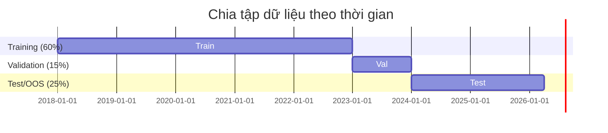
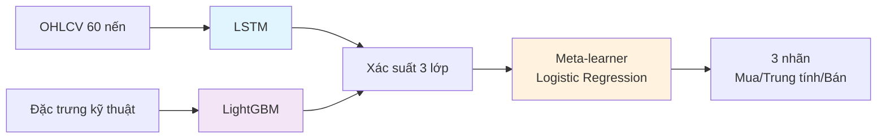

# TRƯỜNG ĐẠI HỌC THUỶ LỢI
## KHOA CÔNG NGHỆ THÔNG TIN

# BẢN TÓM TẮT ĐỀ CƯƠNG ĐỒ ÁN TỐT NGHIỆP

---

| Thông tin | Chi tiết |
|-----------|----------|
| Tên đề tài | Ứng dụng mô hình Hybrid Stacking dự báo tín hiệu giao dịch CFD Vàng |
| Sinh viên thực hiện | Nguyễn Đức Hiếu |
| Lớp | 63CNTT.VA |
| Mã sinh viên | 2151061192 |
| Số điện thoại | 0929033808 |
| Email | hieuteo03@gmail.com |
| Giáo viên hướng dẫn | Hoàng Quốc Dũng |

---

## TÓM TẮT ĐỀ TÀI

Đồ án này tập trung xây dựng mô hình Hybrid Stacking (xếp chồng hỗn hợp) LSTM + LightGBM để dự báo tín hiệu giao dịch CFD Vàng (XAU/USD) trên khung thời gian 1 giờ (H1). Nói ngắn gọn, LSTM và LightGBM là hai mô hình nền; mô hình tầng trên học cách kết hợp dự đoán (xác suất) của chúng để đưa ra quyết định cuối cùng theo 3 nhãn: mua, trung tính hoặc bán. Quy trình thực hiện gồm:

Giải thích nhanh cho người mới (đọc 1 phút):
- XAU/USD là tỷ giá giữa Vàng và USD; trong đề tài dùng dữ liệu theo giờ (khung H1).
- CFD (Contract for Difference) là giao dịch chênh lệch giá (không cần sở hữu vàng vật chất).
- Tick data là dữ liệu thô ghi lại từng lần giá mua/giá bán (Bid/Ask) thay đổi theo thời gian.
- Từ tick data, dữ liệu được gộp thành nến H1 (OHLCV): mỗi nến tóm tắt 1 giờ bằng Open/High/Low/Close (và khối lượng/số tick nếu có).
- Đầu ra của bài toán là 3 nhãn: mua / trung tính / bán (gán nhãn bằng Triple Barrier).

### 1. Quy trình thu thập dữ liệu
- Thu thập tick data lịch sử từ Dukascopy (dữ liệu thô ghi lại từng lần giá Bid/Ask thay đổi theo thời gian).
- Gộp tick data thành nến OHLCV ở khung H1 (1 nến = 1 giờ; gồm Open/High/Low/Close và khối lượng/số tick nếu có).
- Dải thời gian dữ liệu: 01/2018 - 03/2026 (hơn 8 năm).
- Sau khi làm sạch và chuẩn hóa, dự kiến còn khoảng 52.000 nến H1 hữu hiệu.
- Khi huấn luyện mô hình chính, ưu tiên dữ liệu từ 2018 trở đi để phản ánh thị trường hiện tại tốt hơn.

### 2. Kỹ thuật tạo đặc trưng
Mục tiêu của bước này là biến dữ liệu giá thô thành các tín hiệu có ý nghĩa để mô hình nhận ra bối cảnh thị trường và dự báo 3 nhãn mua / trung tính / bán. Trong phần đánh giá, câu hỏi mô hình dựa vào đặc trưng nào để ra quyết định sẽ được định lượng bằng feature importance (LightGBM) và SHAP (kế hoạch).

Xây dựng bộ đặc trưng kỹ thuật để mô tả nhiều góc nhìn của thị trường:

| Nhóm | Đặc trưng | Mô tả |
|------|-----------|-------|
| Xu hướng | EMA(20, 50, 200) | Theo dõi hướng đi chính của giá |
| Động lượng | RSI(14) | Đo mức mạnh/yếu của nhịp tăng giảm |
| Biến động | ATR(14) | Đo độ dao động của thị trường |
| Sức mạnh xu hướng | MACD(12, 26, 9) | Kiểm tra xu hướng có còn mạnh hay không |
| Phiên giao dịch | Giờ trong ngày (theo timezone thị trường) | Phân biệt hành vi giá theo phiên London, New York, Tokyo (DST-aware) |
| Hỗ trợ/Kháng cự | Pivot Points | Các vùng giá quan trọng trong ngày |
| Vi cấu trúc | Spread | Chênh lệch Bid-Ask, phản ánh điều kiện khớp lệnh |

Nhìn theo câu hỏi thị trường (giải thích trực quan):
- Xu hướng (EMA): giá đang nghiêng tăng hay giảm?
- Động lượng (RSI, MACD): đà tăng/giảm mạnh hay yếu?
- Biến động (ATR): thị trường đang rộng biên hay hẹp biên (liên quan TP/SL và Triple Barrier)?
- Phiên giao dịch (giờ trong ngày): hành vi giá có khác nhau theo phiên? (chuẩn hóa UTC và quy đổi theo timezone phiên)
- Hỗ trợ/kháng cự (Pivot): giá đang gần vùng quan trọng?
- Vi cấu trúc (Spread): điều kiện khớp lệnh và chi phí giao dịch.

### 3. Chiến lược lọc dữ liệu
- Lọc nến bất thường: xử lý các nến có biến động quá lớn (ví dụ râu nến vượt 3-5 lần ATR) để giảm nhiễu.
- Lọc theo thời điểm giao dịch: bỏ dữ liệu cuối tuần và các đoạn đóng/mở cửa dễ gây sai lệch.
- Ngày giao dịch được neo theo America/New_York với mốc rollover 17:00 để phản ánh lịch CFD/FX thực tế.
- Cách neo này giúp xử lý nhất quán các tuần chuyển DST, tránh lệch ngày khi chỉ dùng lịch UTC thuần.
- Tách bối cảnh thị trường: tập trung vào giai đoạn 2018-03/2026 và kiểm tra độ ổn định theo từng phân đoạn trong chính giai đoạn này.

### 4. Chiến lược gán nhãn
Sử dụng Triple Barrier Method để gán 3 nhãn (+1, 0, -1):

| Nhãn | Điều kiện | Ý nghĩa |
|------|-----------|---------|
| +1 | Giá chạm mức chốt lời trước mức cắt lỗ trong cửa sổ h | Tín hiệu mua |
| 0 | Không chạm cả 2 mức cho đến rào thời gian | Trung tính/đi ngang |
| -1 | Giá chạm mức cắt lỗ trước mức chốt lời trong cửa sổ h | Tín hiệu bán |

- Ngưỡng chốt lời: Close[t] + 2×ATR
- Ngưỡng cắt lỗ: Close[t] - 1×ATR
- Rào thời gian: h = 10 nến
- Hệ số ATR: 1.0

Phương án dự phòng:
- Điều chỉnh độ rộng hai ngưỡng (TP/SL) và kỳ dự báo h để giảm tình trạng nhãn 0 quá nhiều.
- So sánh thêm với cách gán nhãn theo kỳ dự báo cố định để kiểm tra độ ổn định.

### 5. Chia tập dữ liệu theo trục thời gian
- Không xáo trộn dữ liệu theo thời gian để tránh rò rỉ thông tin tương lai.
- Tập huấn luyện (Training): 2018-01-01 đến 2022-12-31 (60%).
  - Bao gồm: Giai đoạn bình thường (2018), chiến tranh thương mại Mỹ-Trung (2019), cú sốc COVID-19 ban đầu, phục hồi và chuẩn bị cho Fed tăng lãi suất.
  - Mục tiêu: Giúp mô hình học cách vàng phản ứng với biến động lãi suất thông thường và khủng hoảng vừa phải.
- Tập kiểm định (Validation): 2023-01-01 đến 2023-12-31 (15%), dùng để tạo meta-features cho stacking.
  - Cột mốc: Fed tăng lãi suất mạnh nhất trong nhiều thập kỷ, xung đột Nga-Ukraine tiếp diễn, ngân hàng Mỹ (SVB) sụp đổ.
  - Mục tiêu: Tạo dự đoán ngoài mẫu nội bộ (out-of-fold predictions) cho hai mô hình nền để huấn luyện tầng trên.
- Tập kiểm tra ngoài mẫu (Out-of-Sample, OOS): 2024-01-01 đến 2026-03-31 (25%), chỉ dùng để đánh giá cuối cùng.
  - Cột mốc: Giai đoạn vàng tăng giá phi mã từ 2065 USD lên 4494 USD (+117%), bất chấp lãi suất cao.
  - Mục tiêu: Kiểm tra khả năng dự báo trong chế độ thị trường mới – nơi vàng tăng giá bất chấp lãi suất cao.
  - Lưu ý: Giai đoạn này chứng kiến sự tăng giá chưa từng có của vàng, có thể gây ra kết quả backtest bị ảnh hưởng bởi chế độ thị trường đặc biệt.
- Đánh giá chéo nội bộ: Walk-Forward Validation (kiểm định cuốn chiếu) / TimeSeriesSplit trong giai đoạn huấn luyện - kiểm định.



- Mô tả các giai đoạn:
  - 2018-2022: Normal + Trade War + COVID shock
  - 2023: Fed hike + SVB crisis  
  - 2024-03/2026: Gold ATH period (+117% price inc)

### 6. Purging và Embargo (Làm sạch và Cách ly - Chống rò rỉ dữ liệu)
- Purging (Làm sạch): Loại bỏ các mẫu nằm ở vùng giao thoa khi tạo nhãn bằng cách sử dụng dữ liệu tương lai (h = 10 nến).
- Embargo (Cách ly): Chèn khoảng trống (10-20 nến) giữa các tập dữ liệu để hạn chế ảnh hưởng chéo theo thời gian.
- Lưu ý cho LSTM: Kiểm soát chặt chẽ cửa sổ trượt 60 nến ở ranh giới các tập để ngăn chặn rò rỉ thông tin.
- Phòng ngừa data leakage cho LSTM normalization: LSTM cần save training statistics (mean, std) vào file riêng. Khi dự báo trên test set, sử dụng training stats để normalize (không dùng test stats).

### 7. Xử lý mất cân bằng nhãn
- Vấn đề: Trong hệ 3 lớp, nhãn 0 (đi ngang) thường xuất hiện nhiều nhất, dẫn đến mất cân bằng dữ liệu.
- Giải pháp:
  - Áp dụng giảm mẫu (downsampling) cho nhãn 0.
  - Hoặc gán trọng số theo lớp (class weighting) khi huấn luyện LightGBM.
- Đánh giá:
  - Sử dụng F1 Macro để đánh giá tổng thể.
  - Theo dõi chỉ số theo từng lớp để đảm bảo mô hình không bị thiên lệch về lớp trung tính (nhãn 0).

---

## KIẾN TRÚC MÔ HÌNH HYBRID STACKING

Đề án triển khai mô hình Hybrid Stacking theo nguyên tắc: hai mô hình tầng dưới dự báo độc lập, sau đó mô hình tầng trên học cách kết hợp để ra nhãn cuối.



### Tóm tắt các tầng:

| Tầng | Mô tả | Kỹ thuật |
|------|------|----------|
| Tầng dưới 1 | LSTM nhận chuỗi OHLCV (cửa sổ 60 nến) và dự báo xác suất 3 lớp | PyTorch LSTM, early stopping (dừng sớm). Lưu training stats để ngăn data leakage. |
| Tầng dưới 2 | LightGBM nhận đặc trưng kỹ thuật và dự báo xác suất 3 lớp | Optuna tối ưu tham số, kiểm định theo thời gian |
| Tầng trên | Meta-learner (Logistic Regression) nhận đầu vào là xác suất từ 2 mô hình tầng dưới (2×3 = 6 giá trị) và dự báo nhãn cuối | Kiểm định cuốn chiếu theo thời gian để tạo dự đoán ngoài mẫu nội bộ, Purging/Embargo |

### Ưu điểm kiến trúc Hybrid Stacking:
- Hai góc nhìn bổ sung: LSTM học mẫu theo chuỗi, LightGBM học quan hệ phi tuyến trên đặc trưng kỹ thuật.
- Kết hợp linh hoạt: tầng trên tự học khi nào nên tin mô hình nào hơn theo bối cảnh thị trường.
- Giảm rò rỉ thông tin: dữ liệu huấn luyện tầng trên được tạo theo đúng trục thời gian (kèm Purging/Embargo).
- Ngăn data leakage: LSTM sử dụng training normalization stats khi dự báo trên test set.

### Backtest (kiểm thử chiến lược trên dữ liệu quá khứ)
Đánh giá hiệu năng giao dịch với chiến lược:
- Chốt lời: 2×ATR
- Cắt lỗ: 1×ATR
- Tỷ lệ Rủi ro/Lợi nhuận: 2:1
- Nguyên tắc đánh giá: chỉ backtest trên tập Out-of-Sample (OOS) một lần ở bước cuối cùng
- Tham số backtest: Spread 2 pips, Slippage 1 pip, Max position 2.0 lots, Risk per trade 1%

---

## CÁC MỤC TIÊU CHÍNH

| STT | Mục tiêu | Mô tả |
|-----|----------|-------|
| 1 | Thu thập và chuẩn hóa dữ liệu | Chuẩn bị dữ liệu CFD Vàng (XAU/USD) giai đoạn 2018-03/2026, đưa về khung H1 và kiểm tra chất lượng dữ liệu trước khi huấn luyện |
| 2 | Làm sạch dữ liệu đầu vào | Loại bớt dữ liệu nhiễu: nến bất thường, dữ liệu cuối tuần, khoảng trống phiên và xem xét khác biệt giữa các giai đoạn thị trường |
| 3 | Chia dữ liệu theo thời gian | Chia rõ 3 tập theo mốc thời gian: huấn luyện (2018-2022), kiểm định (2023), kiểm tra ngoài mẫu (2024-03/2026), không xáo trộn |
| 4 | Ngăn rò rỉ dữ liệu giữa các tập | Áp dụng Purging và Embargo để tránh dùng nhầm thông tin tương lai khi kỳ dự báo là 10 nến và cửa sổ chuỗi là 60 nến. Fix LSTM data leakage bằng cách save/load training normalization stats. |
| 5 | Xây dựng bộ đặc trưng kỹ thuật | Tạo bộ đặc trưng gồm EMA, RSI, MACD, ATR, Pivot Points, Spread và đặc trưng theo thời gian trong ngày; đồng thời định lượng mức độ ảnh hưởng của từng đặc trưng/nhóm đặc trưng bằng feature importance và SHAP |
| 6 | Huấn luyện mô hình LSTM nền | Huấn luyện LSTM trên chuỗi OHLCV (cửa sổ 60 nến) để dự báo xác suất 3 nhãn. Lưu training stats để ngăn data leakage. |
| 7 | Huấn luyện mô hình LightGBM nền | Huấn luyện LightGBM trên bộ đặc trưng kỹ thuật, tối ưu tham số bằng Optuna và xử lý mất cân bằng nhãn |
| 8 | Xây dựng mô hình Hybrid Stacking | Tạo dự đoán ngoài mẫu nội bộ theo thời gian cho 2 mô hình nền, sau đó huấn luyện mô hình tầng trên (meta-learner) để kết hợp và xuất tín hiệu cuối |
| 9 | Giải thích mô hình và kiểm thử thực tế | Dùng SHAP để làm rõ đặc trưng/nhóm đặc trưng ảnh hưởng mạnh đến dự báo của mô hình và backtest một lần trên tập ngoài mẫu để đánh giá khả năng áp dụng thực tế |

---

## KẾT QUẢ DỰ KIẾN

### 1. Kết quả về dữ liệu
- Dữ liệu CFD Vàng (XAU/USD) khung H1 trong giai đoạn 01/2018 - 03/2026.
- Sau khi làm sạch và chuẩn hóa, dự kiến còn khoảng 48.000 - 52.000 nến.
- Dữ liệu được chia theo thời gian: huấn luyện (Training) 2018-2022, kiểm định (Validation) 2023, ngoài mẫu (Out-of-Sample, OOS) 2024-03/2026.
- Bộ dữ liệu cuối cùng có 20+ đặc trưng đã xử lý.

### 2. Kết quả mô hình LightGBM nền
- Có bộ chỉ số nền gồm F1 Macro và Accuracy để làm mốc so sánh.
- Có bảng tầm quan trọng đặc trưng để chỉ ra đặc trưng/nhóm đặc trưng đóng góp mạnh vào dự báo.
- Thời gian huấn luyện dự kiến khoảng 30 giây.

### 3. Kết quả mô hình LSTM nền
- Có biểu đồ quá trình huấn luyện để theo dõi mức độ hội tụ.
- Dự báo được xác suất 3 nhãn (+1, 0, -1) trên dữ liệu Out-of-Sample (OOS).
- Thời gian huấn luyện dự kiến khoảng 2-5 phút.

### 4. Kết quả mô hình Hybrid Stacking (LSTM + LightGBM)
- F1 Macro kỳ vọng cao hơn khi so với từng mô hình chạy riêng.
- Độ chính xác dự kiến cải thiện hoặc ổn định hơn.
- Có phân tích đóng góp của từng mô hình nền và vai trò tầng trên (dựa trên SHAP hoặc hệ số mô hình).
- Thời gian chạy toàn bộ quy trình dự kiến khoảng 3-7 phút.

### 5. Kết quả backtest
- Báo cáo các chỉ số chính: tổng số lệnh, tỷ lệ thắng, tổng R-multiples.
- Đánh giá rủi ro và hiệu quả qua Maximum Drawdown, Profit Factor, Sharpe, Sortino, Calmar.
- Backtest chỉ thực hiện một lần trên tập ngoài mẫu để đánh giá năng lực thực chiến.

### 6. Kết quả giải thích mô hình (SHAP)
- Xác định đặc trưng nào đóng góp nhiều nhất vào quyết định dự báo.
- Giải thích được từng dự đoán cụ thể ở mức cục bộ.
- Cung cấp bức tranh tổng quan toàn mô hình ở mức toàn cục.

---

## KẾT QUẢ THỰC TẾ ĐẠT ĐƯỢC

### Tổng quan tiến độ
- Đã hoàn thành các giai đoạn 1-7 (data, features, labels, split, LightGBM, LSTM, Stacking, Backtest) trong tháng 3/2026.
- Pipeline chạy hoàn chỉnh với kết quả backtest trên tập test (2024-2026).

### Các cải tiến kỹ thuật đã thực hiện
- **Fix LSTM data leakage (28/03/2026)**: Phát hiện và sửa lỗi data leakage trong LSTM normalization. Giải pháp: save training statistics (mean, std) vào file models/lstm_norm_stats.npz, sau đó load để normalize test set (thay vì dùng test stats).
- **Meta-learner**: Sử dụng Logistic Regression kết hợp 6 giá trị xác suất từ 2 mô hình nền.
- **Backtest**: Thực hiện backtest với tham số: Spread 2 pips, Slippage 1 pip, Max position 2.0 lots, Risk per trade 1%.

### Ghi chú về kết quả
- Giai đoạn test (2024-03/2026) chứng kiến gold bull run đặc biệt: giá vàng tăng từ 2065 USD lên 4494 USD (+117%).
- Kết quả backtest cao (1446% return) phản ánh chế độ thị trường đặc biệt này, không phải từ khả năng dự báo hướng (directional accuracy chỉ 50.6%).
- Đây là hiện tượng volatility harvesting trong xu hướng tăng mạnh, không phải dự báo chính xác.

---

## TIẾN ĐỘ THỰC HIỆN

| TT | Thời gian | Nội dung công việc | Kết quả dự kiến đạt được |
|----|-----------|-------------------|-------------------------|
| 1 | 23/03 - 29/03 | Xác định yêu cầu, tìm tài liệu, lập kế hoạch | Đề cương kỹ thuật + lịch làm việc chi tiết |
| 2 | 30/03 - 31/03 | Tải và chuẩn hóa dữ liệu CFD Vàng (XAU/USD) | Dữ liệu CFD đã chuẩn hóa |
| 3 | 01/04 - 02/04 | Làm sạch dữ liệu và kiểm tra chất lượng | Dữ liệu sạch + báo cáo chất lượng |
| 4 | 03/04 - 07/04 | Tính chỉ báo, gán nhãn, chia thành 3 tập | Dữ liệu sẵn sàng huấn luyện mô hình |
| 5 | 08/04 - 12/04 | Huấn luyện mô hình LightGBM | Mô hình LightGBM + kết quả ban đầu |
| 6 | 13/04 - 20/04 | Huấn luyện LSTM; dùng dự đoán của LSTM và LightGBM để huấn luyện mô hình kết hợp (tầng trên) | Có mô hình Hybrid Stacking hoàn chỉnh chạy ổn định |
| 7 | 21/04 - 30/04 | So sánh mô hình, backtest, giải thích | Bộ số liệu đầy đủ + biểu đồ |
| 8 | 01/05 - 28/06 | Viết báo cáo và chuẩn bị thuyết trình | Báo cáo cuối + slide trình bày |

---

## CHÚ THÍCH THUẬT NGỮ

| Thuật ngữ | Giải thích ngắn gọn |
|-----------|---------------------|
| OHLCV | 5 thông tin của một nến: giá mở cửa, cao nhất, thấp nhất, đóng cửa và khối lượng. |
| Nến (Candlestick/Bar) | Bản tóm tắt biến động giá trong một khoảng thời gian cố định (đồ án dùng 1 giờ). |
| Tick data | Dữ liệu gốc ghi lại từng lần giá mua/giá bán thay đổi theo thời gian. |
| EMA | Đường trung bình động ưu tiên dữ liệu mới, giúp nhìn xu hướng nhanh hơn. |
| RSI | Chỉ báo cho biết nhịp tăng/giảm đang mạnh hay yếu. |
| MACD | Chỉ báo dùng chênh lệch giữa các đường trung bình để nhận biết xu hướng và đà giá. |
| ATR | Chỉ báo đo độ dao động trung bình của giá (thị trường yên hay biến động mạnh). |
| CFD (Contract for Difference) | Giao dịch chênh lệch giá, không cần sở hữu vàng thật. |
| Spread (Bid-Ask) | Khoảng chênh giữa giá mua và giá bán, có thể xem như chi phí vào lệnh. |
| Triple Barrier | Cách gán nhãn theo 3 mốc: chốt lời, cắt lỗ và hết thời gian dự báo. |
| h (kỳ dự báo) | Số nến nhìn trước để quyết định nhãn cho một mẫu dữ liệu. |
| Purging | Bỏ các mẫu ở vùng giáp ranh để tránh lẫn thông tin tương lai. |
| Embargo | Chèn một khoảng trống thời gian giữa các tập dữ liệu để giảm rò rỉ thông tin. |
| Walk-Forward Validation | Huấn luyện trên giai đoạn cũ, kiểm tra trên giai đoạn kế tiếp và lặp lại theo thời gian. |
| TimeSeriesSplit | Cách chia dữ liệu chuỗi thời gian vẫn giữ đúng thứ tự trước-sau. |
| Overfitting | Mô hình học quá kỹ dữ liệu cũ nên dự đoán dữ liệu mới kém. |
| F1 Macro | Điểm đánh giá trung bình đều giữa các lớp, tránh thiên vị lớp có nhiều mẫu. |
| Out-of-Sample (OOS) | Dữ liệu chưa dùng để huấn luyện/tối ưu, chỉ dùng đánh giá cuối cùng. |
| Backtest | Chạy thử chiến lược trên dữ liệu quá khứ để ước lượng hiệu quả. |
| SHAP | Cách giải thích mỗi đặc trưng đóng góp bao nhiêu vào dự đoán. |
| Maximum Drawdown | Mức sụt giảm lớn nhất của đường vốn từ đỉnh xuống đáy. |
| Profit Factor | Tỷ lệ tổng lãi chia tổng lỗ; thường càng cao càng tốt. |
| Sharpe / Sortino / Calmar | Các chỉ số so sánh lợi nhuận với rủi ro của chiến lược. |
| Data Leakage | Rò rỉ thông tin từ tập test vào quá trình huấn luyện/dự báo. |
| Normalization | Chuẩn hóa dữ liệu về cùng thang đo (thường là mean=0, std=1). |

---

## TÀI LIỆU THAM KHẢO

### Bài báo khoa học - Học tổ hợp lai (Hybrid Ensemble Learning)

1. Ke, G., et al. (2017). LightGBM: A Highly Efficient Gradient Boosting Decision Tree. NeurIPS.

2. Hochreiter, S., & Schmidhuber, J. (1997). Long Short-Term Memory. Neural Computation, 9(8), 1735-1780.

3. Gradient Boosting and LSTM Based Hybrid Ensemble Learning for Two Step Prediction of Stock Market. (2023). Journal of Artificial Intelligence and Technology. https://www.jait.us/uploadfile/2023/JAIT-V14N6-1254.pdf

4. Leveraging Hybrid Ensemble Models in Stock Market Prediction. (2025). AIMS Press - Data Science in Finance and Economics. https://www.aimspress.com/article/doi/10.3934/DSFE.2025015

5. A Hybrid LSTM-GRU Model for Stock Price Prediction. IEEE Xplore. https://ieeexplore.ieee.org/document/11072109

6. Gradient Boosting Decision Tree with LSTM for Investment Prediction. (2025). arXiv. https://arxiv.org/html/2505.23084v1

### Bài báo khoa học - Dự báo giá vàng (XAU/USD)

7. Gold price prediction by a CNN-Bi-LSTM model along with Transformer and Attention. (2024). PeerJ Computer Science. https://pmc.ncbi.nlm.nih.gov/articles/PMC10919698/

8. Daily Gold price forecasting using LSTM cells and Attention mechanism. (2021). Stanford University CS230 Project. http://cs230.stanford.edu/projects_spring_2021/reports/34.pdf

9. Gold Price Prediction Based on LSTM-Attention Combined Model. (2024). Scientific Research Publishing. https://www.scirp.org/journal/paperinformation?paperid=148765

10. Forex Trend Prediction: Can Machine Learning Algorithms Forecast Currency Pairs? (Thesis). https://campus-fryslan.studenttheses.ub.rug.nl/751/1/Thesis---Alireza-Behjoee.pdf

### Tài liệu - Phương pháp Triple Barrier và máy học tài chính

11. López de Prado, M. (2018). Advances in Financial Machine Learning. Wiley. https://www.wiley.com/en-us/Advances+in+Financial+Machine+Learning-p-9781119482086

12. Lundberg, S.M., & Lee, S.I. (2017). A Unified Approach to Interpreting Model Predictions. NeurIPS. (SHAP)

13. mlfinpy Documentation - Data Labeling. https://mlfinpy.readthedocs.io/en/latest/Labelling.html

14. The Triple Barrier Method: Labeling Financial Time Series for ML. https://medium.com/@yairoz/the-triple-barrier-method-labeling-financial-time-series-for-ml-in-elixir-e539301b90d6

15. An expansion of the Triple-Barrier Method by Marcos López de Prado. GitHub. https://github.com/nkonts/barrier-method

### Tài liệu - Purging, Embargo và kiểm định chéo

16. KFold cross-validation with purging and embargo: The Ultimate Cross-Validation Technique for Time Series. https://antonio-velazquez-bustamante.medium.com/kfold-cross-validation-with-purging-and-embargo-the-ultimate-cross-validation-technique-for-time-2d656ea6f476

17. Purging and Embargo - Two Tricks That Stop Time Series Models from Cheating. https://abouttrading.substack.com/p/purging-and-embargo-two-tricks-that

18. Cross Validation in Finance: Purging, Embargoing, Combinatorial. QuantInsti. https://blog.quantinsti.com/cross-validation-embargo-purging-combinatorial/

19. Purged cross-validation. Wikipedia. https://en.wikipedia.org/wiki/Purged_cross-validation

### Tài liệu - Kiểm định cuốn chiếu và backtesting

20. Understanding Walk Forward Validation in Time Series Analysis. https://medium.com/@ahmedfahad04/understanding-walk-forward-validation-in-time-series-analysis-a-practical-guide-ea3814015abf

21. Walk-Forward Optimization (WFO). QuantInsti. https://blog.quantinsti.com/walk-forward-optimization-introduction/

22. How To Backtest Machine Learning Models for Time Series Forecasting. Machine Learning Mastery. https://www.machinelearningmastery.com/backtest-machine-learning-models-time-series-forecasting/

23. Backtesting Series – Episode 2: Cross-Validation techniques. BSIC. https://bsic.it/backtesting-series-episode-2-cross-validation-techniques/

### Tài liệu - Chỉ báo kỹ thuật trong máy học

24. Key technical indicators for stock market prediction. (2025). ScienceDirect. https://www.sciencedirect.com/science/article/pii/S2666827025000143

25. Assessing the Impact of Technical Indicators on Machine Learning Models. (2024). arXiv. https://arxiv.org/html/2412.15448v1

26. Technical indicator empowered intelligent strategies to predict stock trends. (2024). ScienceDirect. https://www.sciencedirect.com/science/article/pii/S2199853124001926

27. Financial Technical Indicator and Algorithmic Trading Strategy Based on ML. ResearchGate. https://www.researchgate.net/publication/365746945

### Tài liệu - Giải thích mô hình SHAP trong tài chính

28. Explainable Reinforcement Learning on Financial Stock Trading with SHAP. (2022). arXiv. https://arxiv.org/abs/2208.08790

29. A SHAP-Based Comparative Analysis of Machine Learning Model Interpretability in Financial Classification Tasks. (2024). ResearchGate. https://www.researchgate.net/publication/395995555

30. Model interpretability of financial fraud detection by group SHAP. (2022). Expert Systems with Applications. https://www.sciencedirect.com/science/article/abs/pii/S0957417422014725

31. Unlocking Explainable AI Models in Finance — Using Shapley Additive Explanations. ABN AMRO. https://medium.com/abn-amro-developer/unlocking-explainable-ai-models-in-finance-using-shap-additive-explanations-part-1-cb903099686e

### Tài liệu - Giao dịch CFD và giao dịch thuật toán

32. Deep learning for algorithmic trading: A systematic review. (2025). ScienceDirect. https://www.sciencedirect.com/science/article/pii/S2590005625000177

33. Optimising CFD trading with high-precision machine learning models. (2025). https://www.swlondoner.co.uk/life/03012025-optimising-cfd-trading-with-high-precision-machine-learning-models

34. The Role of AI and CFD Trading Strategies. FP Markets. https://www.fpmarkets.com/education/trading-guides/the-role-of-ai-in-cfd-trading-strategies/

35. Machine Learning for Algorithmic Trading in Python. Interactive Brokers. https://www.interactivebrokers.com/campus/ibkr-quant-news/machine-learning-for-algorithmic-trading-in-python-a-complete-guide-part-i/

### Tài liệu - Xử lý mất cân bằng dữ liệu

36. Enhancing Stock Market Prediction by Tackling Class Imbalance. https://lseee.net/index.php/te/article/download/1489/TE012582.pdf

37. GDSMOTE: A Novel Synthetic Oversampling Method for High-Dimensional Imbalanced Financial Datasets. (2024). MDPI. https://www.mdpi.com/2227-7390/12/24/4036

### Sách

38. Chan, E. (2021). Quantitative Trading: How to Build Your Own Algorithmic Trading Business. 2nd Edition.

39. Murphy, J.J. (1999). Technical Analysis of the Financial Markets. New York Institute of Finance.

40. Jansen, S. Machine Learning for Algorithmic Trading. Packt Publishing.

41. Hilpisch, Y. Python for Finance. O'Reilly.

42. Chollet, F. Deep Learning with Python. Manning.

### Tài liệu hướng dẫn - Thư viện Python

43. PyTorch Documentation. https://pytorch.org/docs/

44. LightGBM Documentation. https://lightgbm.readthedocs.io/

45. Optuna Documentation. https://optuna.readthedocs.io/

46. SHAP Documentation. https://shap.readthedocs.io/

47. Polars Documentation. https://pola-rs.github.io/polars/

48. mlfinlab - Advances in Financial Machine Learning. GitHub. https://github.com/hudson-and-thames/mlfinlab

49. TA-Lib - Technical Analysis Library. https://ta-lib.org/

50. Backtrader - Backtesting Framework. https://www.backtrader.com/

51. Zipline - Backtesting Library. https://www.zipline.io/

### Bài viết bổ sung

52. What Is Hybrid Machine Learning? Types, Benefits, and Real-World Applications. https://www.investopedia.com/articles/hybrid-machine-learning

53. Hybrid Ensemble Learning Model. https://www.sciencedirect.com/topics/hybrid-ensemble-learning

54. The stacking ensemble method. Towards Data Science. https://towardsdatascience.com/stacking-ensemble-method

55. Exponential Moving Average (EMA): Definition, Formula, and Usage. Investopedia. https://www.investopedia.com/terms/e/ema.asp

56. Relative Strength Index (RSI): What It Is, How It Works, and Formula. Investopedia. https://www.investopedia.com/terms/r/rsi.asp

57. What Is MACD? Investopedia. https://www.investopedia.com/terms/m/macd.asp

58. Average True Range (ATR) Formula, What It Means, and How to Use It. Investopedia. https://www.investopedia.com/terms/a/atr.asp

59. Pivot Point: Definition, Formulas, and How to Calculate. Investopedia. https://www.investopedia.com/terms/p/pivotpoint.asp

60. The Forex 3-Session Trading System. Investopedia. https://www.investopedia.com/articles/forex/11/forex-sessions.asp

---

## CẤU TRÚC ĐỒ ÁN

```
thesis/
├── src/thesis/              # Mã nguồn chính (package Python)
│   ├── data/               # Xử lý dữ liệu
│   ├── features/           # Tạo đặc trưng
│   ├── labels/             # Gán nhãn
│   ├── models/             # Mô hình (LightGBM, LSTM, Stacking)
│   ├── backtest/           # Backtesting
│   └── reporting/          # Báo cáo và SHAP
├── docs/                   # Tài liệu
│   ├── planning/           # Đề cương và kế hoạch
│   ├── Todo.md            # Trạng thái dự án
│   ├── README.md          # Hướng dẫn docs
│   ├── Quickstart.md      # Chạy nhanh
│   ├── Architecture.md    # Kiến trúc
│   ├── Features.md        # Đặc trưng
│   ├── Config.md          # Cấu hình
│   └── Evaluation.md      # Đánh giá kết quả
├── data/
│   ├── raw/XAUUSD/        # Dữ liệu tick từ Dukascopy
│   ├── processed/          # Dữ liệu đã xử lý
│   └── predictions/        # Dự đoán mô hình
├── models/                 # Mô hình đã huấn luyện
│   ├── lightgbm_model.pkl
│   ├── lstm_model.pt
│   ├── lstm_norm_stats.npz  # Training stats (chống data leakage)
│   └── stacking_meta_learner.pkl
├── results/                # Kết quả và báo cáo
│   ├── thesis_report.md
│   ├── backtest_results.json
│   ├── trades_detail.csv
│   └── *.png              # Biểu đồ
├── main.py                # Pipeline chính
├── config.toml            # Cấu hình
└── README.md              # Hướng dẫn dự án
```

---

## HƯỚNG PHÁT TRIỂN

1. Phương pháp tổ hợp (Ensemble) nâng cao:
   - Weighted voting (bỏ phiếu có trọng số)
   - Stacking với meta-learner (mô hình tầng trên)
   - Fusion đa mô hình

2. Thêm đặc trưng: 
   - Sentiment analysis (phân tích cảm xúc) từ tin tức
   - Các chỉ số vĩ mô (lãi suất, CPI, NFP)
   - Order flow analysis (phân tích dòng lệnh)
   - Dữ liệu COT (cam kết của nhà giao dịch)

3. Quản lý rủi ro:
   - Dynamic position sizing (định cỡ vị thế động)
   - Tối ưu hóa danh mục
   - Giới hạn rủi ro dựa trên VaR

4. Hệ thống thời gian thực:
   - Nạp dữ liệu qua WebSocket
   - Dự báo streaming (trực tuyến)
   - Tích hợp auto-trading (giao dịch tự động)

5. Đa tài sản: Mở rộng cho các cặp tiền tệ khác (EUR/USD, GBP/USD, XAG/USD)

---

## YÊU CẦU HỆ THỐNG

| Yêu cầu | Chi tiết |
|---------|----------|
| Python | 3.13+ |
| RAM | 8GB+ (để huấn luyện LSTM và chạy quy trình Hybrid Stacking) |
| GPU | Tùy chọn (tăng tốc huấn luyện LSTM) |
| Dung lượng | 10GB+ cho dữ liệu dài hạn và artifacts huấn luyện |

---

Cập nhật lần cuối: Tháng 3/2026
